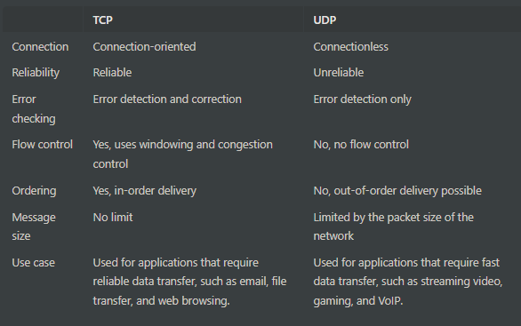
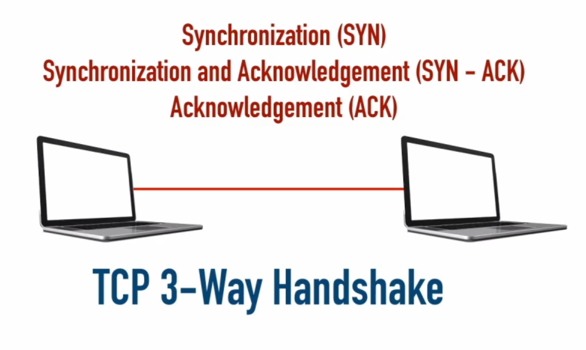
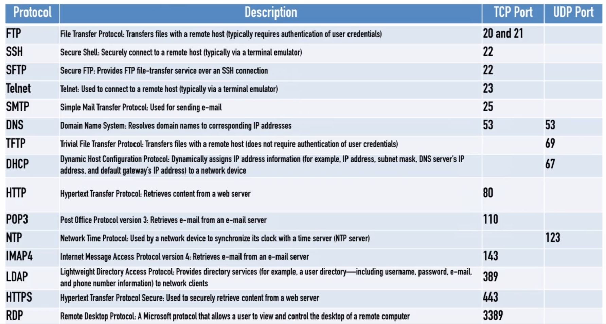

<link rel="stylesheet" type="text/css" href="..\markcss.css">

TCP (Transmission Control Protocol) and UDP (User Datagram Protocol) are two commonly used protocols in computer networking. TCP is a connection-oriented, reliable protocol that provides error detection and correction, flow control, and in-order delivery of data. It is well-suited for applications that require reliable data transfer, such as email, file transfer, and web browsing. UDP, on the other hand, is a connectionless, unreliable protocol that provides fast, low-overhead data transfer. It does not provide error correction or flow control, but is well-suited for applications that require fast data transfer, such as streaming video, gaming, and VoIP.

## TCP 
Transmission Control Protocol

A connection-oriented protocol, which uses a "3- way handshake" to setup a communication session.

3 way handshake

syn - Syncronization

syn - ack : Sincronization and Ackknowledgement

ack - Acknowledgement

Reliable

## UDP

Unreliable but doesnt require a hadshake

Protocols and ports

