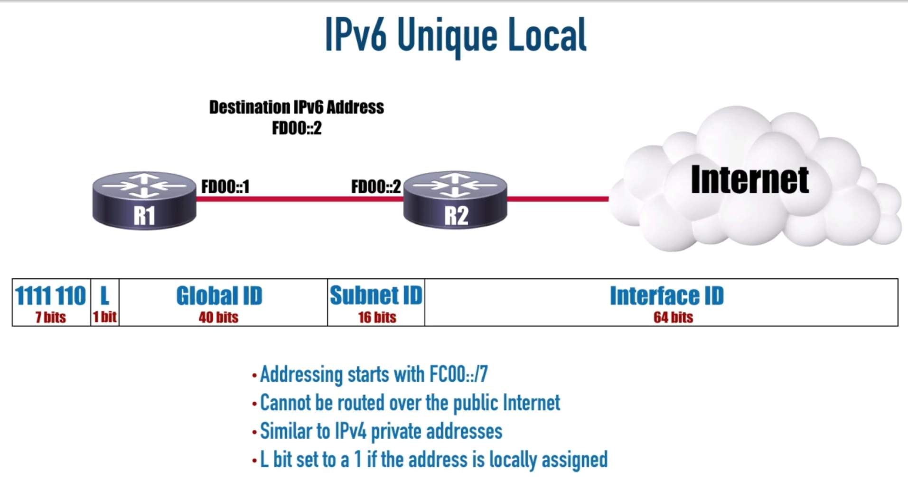

<link rel="stylesheet" type="text/css" href="..\markcss.css">

### IPV6


---
### Types of ipv6 addresses

- globally routable
- one to one
- starts with 200
---


starts with FF


---

 

- starts with FF80

--- 



- starts with FC00 or FD00

--- 


---


--- 


--- 

#### EUI -64


commands:
assign ipv6

```
ipv6 address <ip>/<mask>

ipv6 address <ip>/<mask> eui-64

show ipv6 interface brief
```


