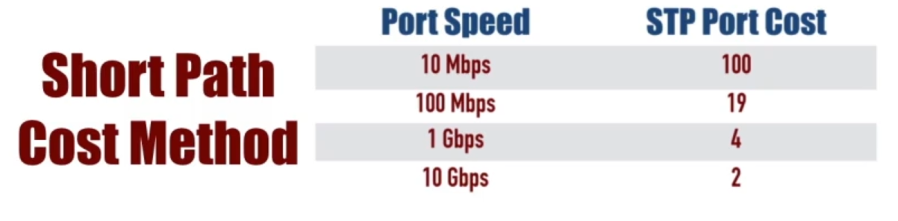
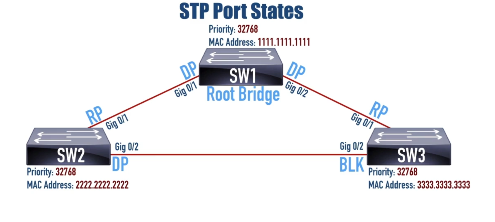

<style>
    html {
        background-color: white;    
    }
    body{
        color:black;
    }
</style>

**default priority** - 32768

**root bridge** - switch with lowest **Lowest Bridge ID**

**bridge Id**:



**Root port** - The one (and only one) port on a ```non-Root Bridge``` tha's closest to the root bridge, in terms of costs. 

**Designated port** - The one (and only one) on ```each segment``` that is closest to the rooot bridge in terms of cost.

**Blocking (Non-Designated) Port** - A Port tha is administratively enabled, but is not a Root Port nor a Designated Port.

<br>

