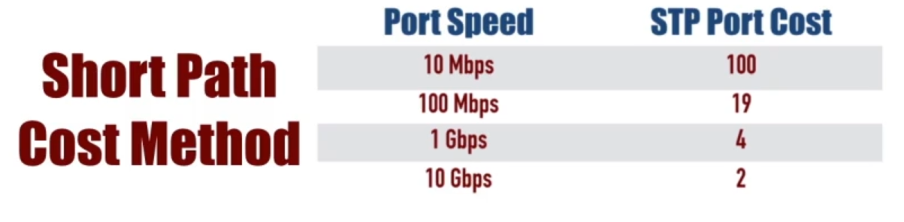
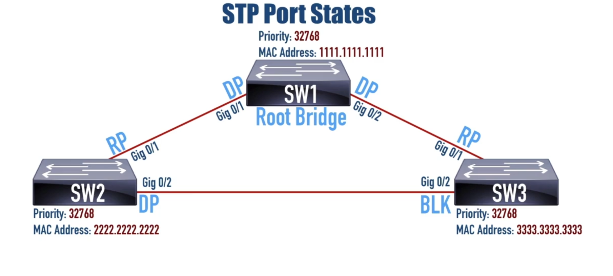
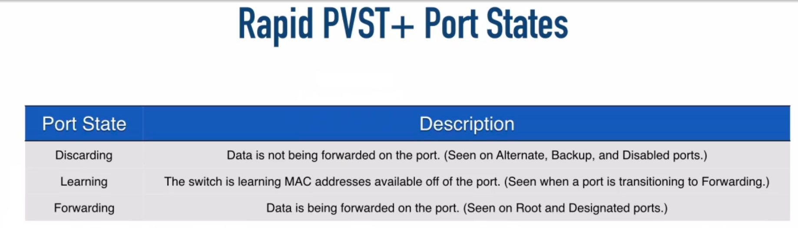
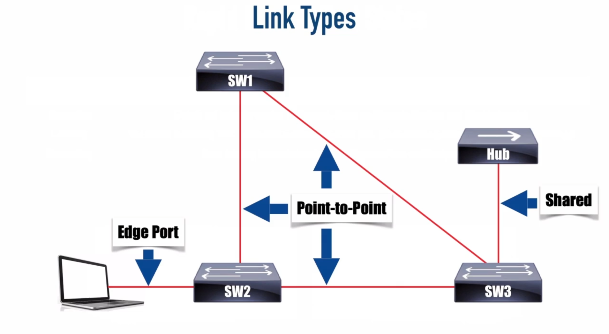

<style>
    html {
        background-color: white;    
    }
    body{
        color:black;
    }
    .vscode-dark pre{
        background-color:black;
    }
    
</style>


https://www.youtube.com/watch?v=i_q-kIgz9Wk

https://www.youtube.com/watch?v=O_PnMolMfGA

**default priority** - 32768

**root bridge** - switch with lowest **Lowest Bridge ID**

**bridge Id**:



**Root port** - The one (and only one) port on a ```non-Root Bridge``` tha's closest to the root bridge, in terms of costs. 

if they have the same costs, we choose by lowest BID, if they have the same BID, we go by port ID in the far end.

**Designated port** - The one (and only one) on ```each segment``` that is closest to the rooot bridge in terms of cost.

**Blocking (Non-Designated) Port** - A Port tha is administratively enabled, but is not a Root Port nor a Designated Port.

<br>



Commands:
```
show spanning-tree
spanning-tree vlan priority <0-61440>
spanning-tree vlan root <primary-secondary>
spanning-tree portfast
spanning-tree portfast
how spanning-tree <interface> portfast
```



```
spanning tree mode
```