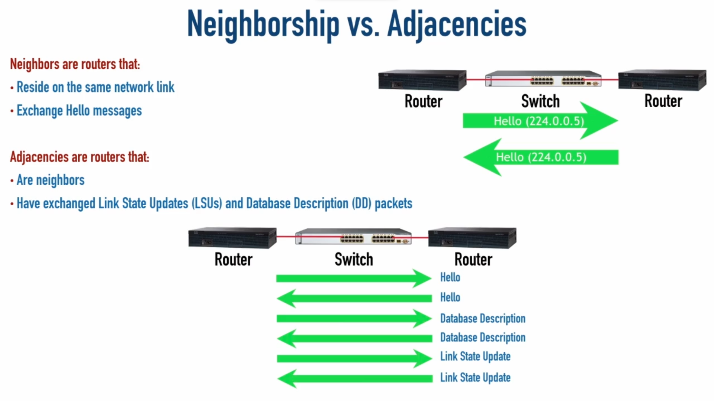

<link rel="stylesheet" type="text/css" href="..\..\markcss.css">



.png)


```
router ospf <process id>
router-id <id as ip>
network <ip> <wildcard mask> <Area>
```

```
show ip ospf neighbor
show ip ospf interface
```