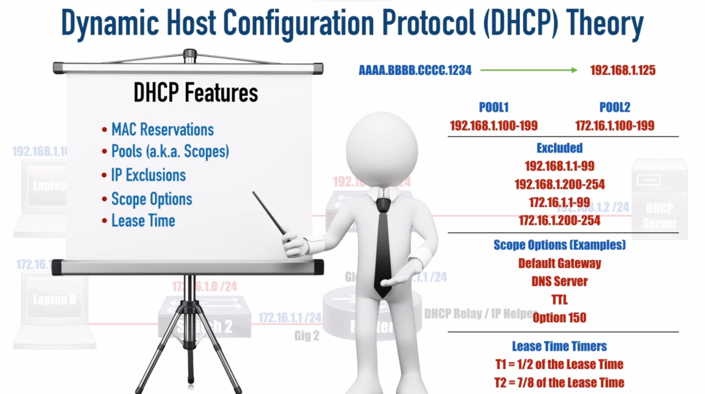

<link rel="stylesheet" type="text/css" href="..\..\markcss.css">



exclude address to give
```
ip dhcp excluded-address <ip range start> <ip range end>
```

dhcp server
```
ip dhcp pool <name>
network <ip> <mask>
default-router <ip>
dns-server <ip>
```

dhcp helper router (Allow dhcp request broadcasts)
```
int <int id>
ip helper-address <dhcp server address>
```


