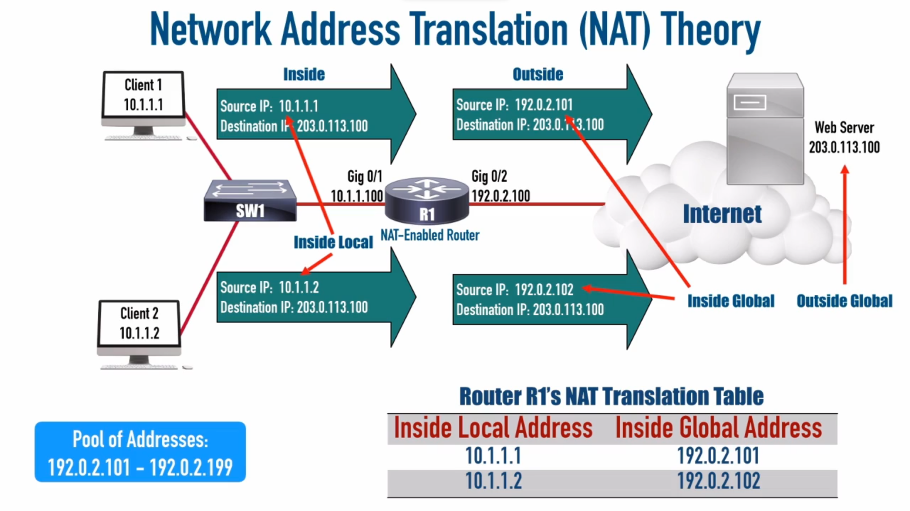
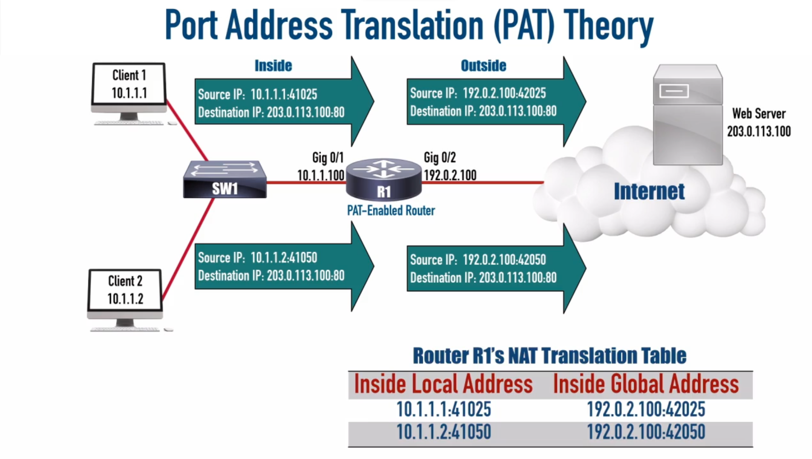
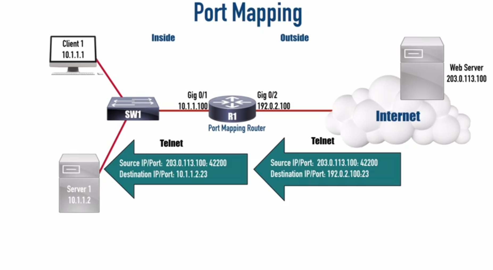

<link rel="stylesheet" type="text/css" href="..\..\markcss.css">

### Network address Translation (Nat)

Changes private to global routable addresses


 

### Port Address trasnlation (pat)

 




### Static Nat conf
inside interface
```
int <int id>
ip nat inside
```

outside interface
```
int <int id>
ip nat outside
```

static nat mapping

```
ip nat inside source static <inside local ip> <inside global ip>
```

show nat table
```
show ip nat translations
```


### Dynamic Nat Conf
inside interface
```
int <int id>
ip nat inside
```

outside interface
```
int <int id>
ip nat outside
```

access list
- permit = match
```
access-list ?
access-list 1 permit <inside local> <wildacard mask> 
```

gloabally routable address pool
where I get my inside global addresses

```
inside nat pool <pool name> <ip range start> <ip range end>  netmask <mask>
```
ties the acl and pool
```
ip nat inside source list <list number> pool <pool name>
```

### PAT conf

inside interface
```
int <int id>
ip nat inside
```

outside interface
```
int <int id>
ip nat outside
```

access list
- permit = match
```
access-list ?
access-list 1 permit <inside local> <wildacard mask> 
```
pat starts

allows multiple coversation in that single ip address at interface (ports)
```
ip nat inside source list <list number> int <interface ad> overload
```
