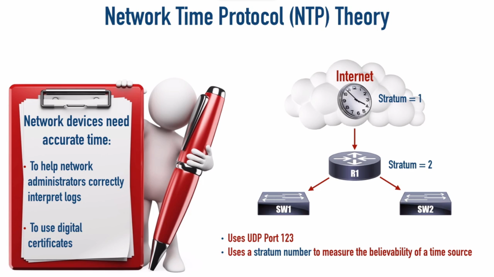

<link rel="stylesheet" type="text/css" href="..\..\markcss.css">

### Network time protocol



stratum value 0-15

not best practice (set ntp master)
```
clock set <hh:mm:ss> <Month dd yyyy>

clock timezone <timezone ex UTC> <ofset -23 - 23>

ntp master ?
```

get time from ntp server
```
ntp server <ntp server ip>
clock timezone <timezone ex UTC> <ofset -23 - 23>
clock summer-time <timezone ex UTC> recurring
````

```
show ntp status
show clock
show ntp associations
```
