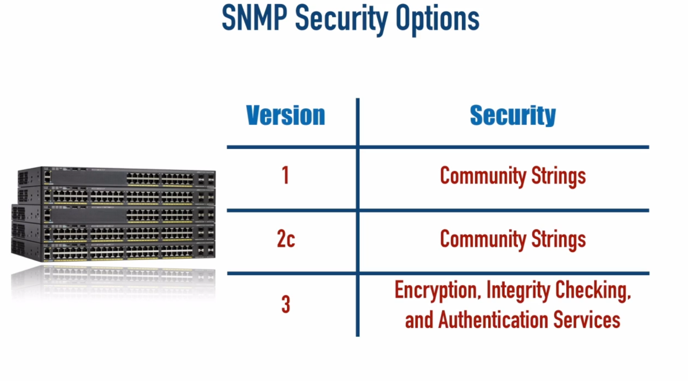

<link rel="stylesheet" type="text/css" href="..\..\markcss.css">
  
  Simple Network Management Protocol


Object identifier (OID)

A component of a device's Management Information Base (MIB) that identifies the current status of some evice characterisitic (e.g temperature)



priviliges= ro, rw
snmp server
```
snmp-srver  community <name> <privileges>
snmp-server location <location>
snmp-server contact <name>
snmp-server host <ip> version <version> <server community name>
ssnmp-server enable traps
snmp-server eengineID local <id 10 digit number>
snmp-server group <name> <version> <security options>
snmp-server user <username> <group name> <version> <sec options> <hash> <password> <encription> <encription2> <encription  password>
```


