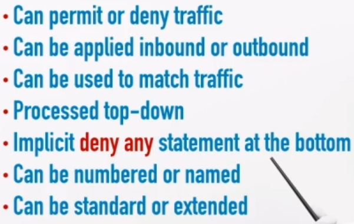
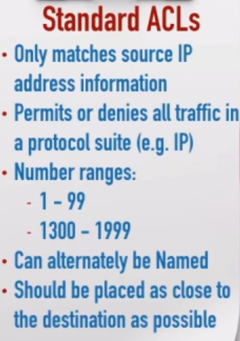
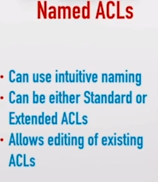

<link rel="stylesheet" type="text/css" href="..\..\markcss.css">

- Can permit or deny trafic

- Can be applied inboud or outbound 

- Can be used to match traffic



---
numbered



```
access-list <? number> permit <?> <ip>
```

```
int <int id>
ip access-group <? usually inside-outside>
```

--- 


```
show access-list
```

```
ip access-list extended <name>
<?>
deny <packet> host <ip> <host> ip
```

edit 
```
ip access-list extended <name> <?>
```