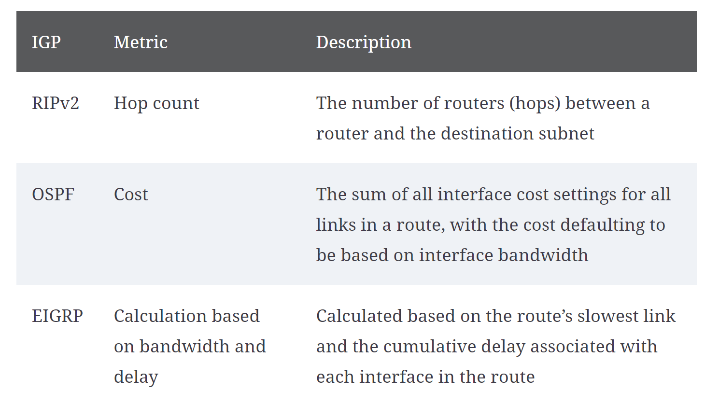
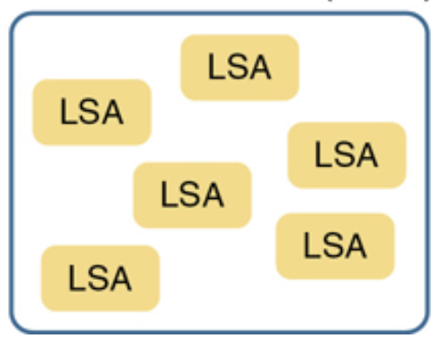

### 1.1.2 Components of OSPF


### Messages

Routers running OSPF exchange messages to convey routing information using five types of packets. These packets, as shown in the figure, are as follows:

* Hello packet
* Database description packet
* Link-state request packet
* Link-state update packet
* Link-state acknowledgment packet

These packets are used to discover neighboring routers and also to exchange routing information to maintain accurate information about the network.

### Data structure

OSPF messages are used to create and maintain three OSPF databases, as follows:

* Adjacency database - This creates the neighbor table.
* Link-state database (LSDB) - This creates the topology table.
* Forwarding database - This creates the routing table.

These tables contain a list of neighboring routers to exchange routing information. The tables are kept and maintained in RAM. In the following table, take a particular note of the command used to display each table


# Oreilly

Interior and Exterior Routing Protocols
IP routing protocols fall into one of two major categories: interior gateway protocols (IGP) or exterior gateway protocols (EGP). The definitions of each are as follows:


* IGP: A routing protocol that was designed and intended for use inside a single autonomous system (AS)

* EGP: A routing protocol that was designed and intended for use between different autonomous systems

**An AS is a network under the administrative control of a single organization.**

Table 19-2 IP IGP Metrics




When IOS must choose between routes learned using different routing protocols(ospf and EIGRP), IOS uses a concept called administrative distance.

Administrative distance is a number that denotes how believable an entire routing protocol is on a single router. The lower the number, the better, or more believable, the routing protocol. For example, RIP has a default administrative distance of 120, OSPF uses a default of 110, and EIGRP defaults to 90. When using OSPF and EIGRP, the router will believe the EIGRP route instead of the OSPF route (at least by default).

https://learning.oreilly.com/library/view/ccna-200-301-official/9780136755562/vol1_ch19.xhtml#:-:text=Administrative%20distance%20is,least%20by%20default).

(how is administrative distance determined?)

**Note: The show ip route command lists each route’s administrative distance as the first of the two numbers inside the brackets. The second number in brackets is the metric.**

Terminology:
* LSA: network data structures link-state advertisements.
* LSDB: link-state database.

LSDB is simply the collection of all the LSAs known to a router.



## OSPF three phases:

* Becoming neighbors: A relationship between two routers that connect to the same data link, created so that the neighboring routers have a means to exchange their LSDBs.

Two routers need to do more than simply exist on the same link to become OSPF neighbors; they must send OSPF messages and agree to become OSPF neighbors. To do so, the routers send OSPF Hello messages, introducing themselves to the potential neighbor. Assuming the two potential neighbors have compatible OSPF parameters, the two form an OSPF neighbor relationship, and would be displayed in the output of the show ip ospf neighbor command.

OSPF neighbors are routers that both use OSPF and both sit on the same data link. Two routers can become OSPF neighbors if connected to the same VLAN, or same serial link, or same Ethernet WAN link.

The router received a Hello from the neighbor, with that router’s own RID listed as being seen by the neighbor.

The router has checked all the parameters in the Hello received from the neighbor, with no problems. The router is willing to become an OSPF neighbor.

If both routers reach a 2-way state with each other, it means that both routers meet all OSPF configuration requirements to become neighbors. Effectively, at that point, they are neighbors and ready to exchange their LSDB with each other.


* Exchanging databases: The process of sending LSAs to neighbors so that all routers learn the same LSAs.

* Adding the best routes: The process of each router independently running SPF, on their local copy of the LSDB, calculating the best routes, and adding those to the IPv4 routing table.


**OSPF Areas Reduce SPF Calculation Time**

SPF spends most of its processing time working through all the topology details, namely routers and the links that connect routers. Areas reduce SPF’s workload because, for a given area, the LSDB lists only routers and links inside that area.

key points arguing for the use of multiple areas in larger OSPF networks:

* Routers require fewer CPU cycles to process the smaller per-area LSDB with the SPF algorithm, reducing CPU overhead and improving convergence time.

* The smaller per-area LSDB requires less memory.

* Changes in the network (for example, links failing and recovering) require SPF calculations only on routers in the area where the link changed state, reducing the number of routers that must rerun SPF.

* Less information must be advertised between areas, reducing the bandwidth required to send LSAs.


````
show ip ospf database 
````


# Key terms

https://learning.oreilly.com/library/view/ccna-200-301-official/9780136755562/vol1_ch19.xhtml#:-:text=Key%20Terms%20You%20Should%20Know

convergence

Shortest Path First (SPF) algorithm

distance vector

Interior Gateway Protocol (IGP)

link-state

link-state advertisement (LSA)

link-state database (LSDB)

metric

2-way state

full state

Area Border Router (ABR)

designated router (DR)

backup designated router (BDR)

fully adjacent

Hello Interval

Dead Interval

link-state update

neighbor

router ID (RID)

topology database

internal router

backbone area


Copy
copy

Highlight
highlight

Add Note
note

Get Link
link
table 