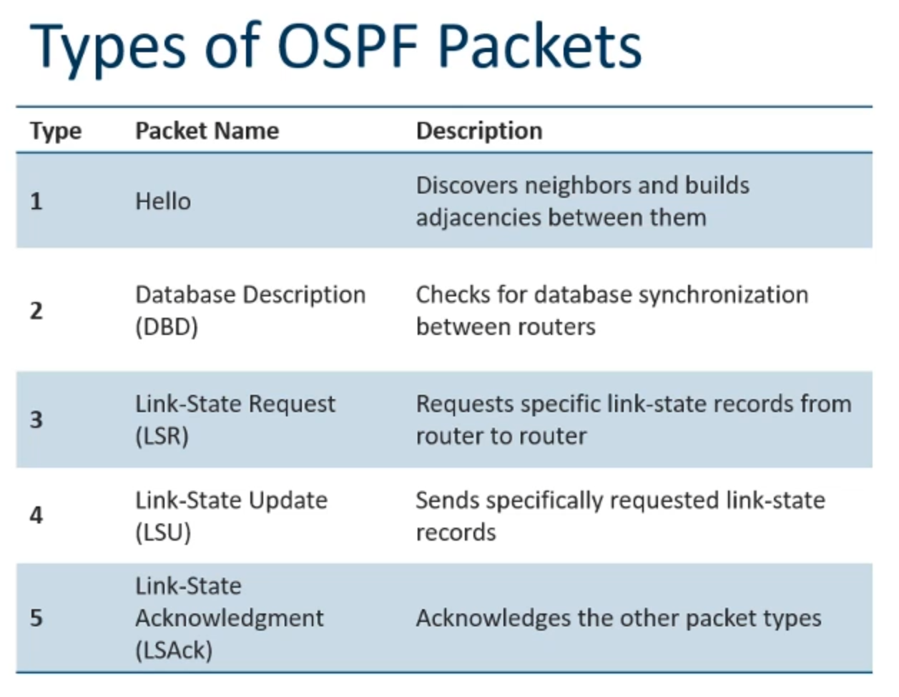
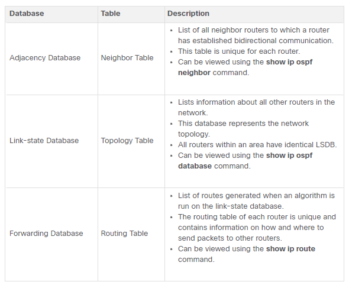
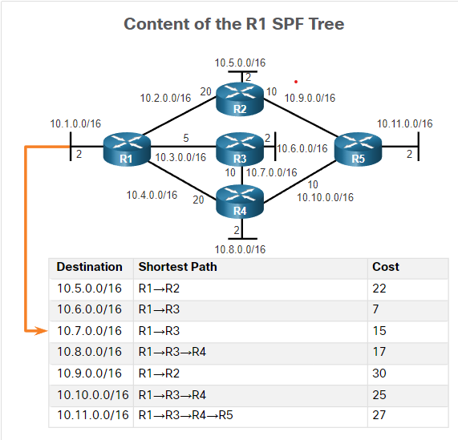
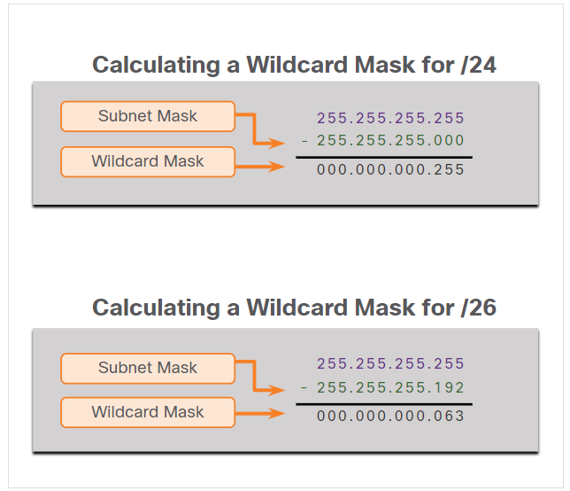

### 1.1.2 Components of OSPF


### - Messages

Routers running OSPF exchange messages to convey routing information using five types of packets. These packets, as shown in the figure, are as follows:

* Type 1: Hello packet - This is used to establish and maintain adjacency with other OSPF routers.
* Type 2: Database Description (DBD) packet - This contains an abbreviated list of the LSDB of the sending router and is used by receiving routers to check against the local LSDB. The LSDB must be identical on all link-state routers within an area to construct an accurate SPF tree.
* Type 3: Link-State Request (LSR) packet - Receiving routers can then request more information about any entry in the DBD by sending an LSR.
* Type 4: Link-State Update (LSU) packet - This is used to reply to LSRs and to announce new information. LSUs contain several different types of LSAs.
* Type 5: Link-State Acknowledgment (LSAck) packet - When an LSU is received, the router sends an LSAck to confirm receipt of the LSU. The LSAck data field is empty.

These packets are used to discover neighboring routers and also to exchange routing information to maintain accurate information about the network.



### - Data structure

OSPF messages are used to create and maintain three OSPF databases, as follows:

* Adjacency database - This creates the neighbor table.
* Link-state database (LSDB) - This creates the topology table.
* Forwarding database - This creates the routing table.

These tables contain a list of neighboring routers to exchange routing information. The tables are kept and maintained in RAM. In the following table, take a particular note of the command used to display each table.



### -Algorithm
The router builds the topology table using results of calculations based on the Dijkstra shortest-path first (SPF) algorithm. The SPF algorithm is based on the cumulative cost to reach a destination.

The SPF algorithm creates an SPF tree by placing each router at the root of the tree and calculating the shortest path to each node. The SPF tree is then used to calculate the best routes. OSPF places the best routes into the forwarding database, which is used to make the routing table.


### 1.1.3 

The following are the link-state routing steps that are completed by a router:

1. Establish Neighbor Adjacencies

    OSPF-enabled routers must recognize each other on the network before they can share information. An OSPF-enabled router sends Hello packets out all OSPF-enabled interfaces to determine if neighbors are present on those links. If a neighbor is present, the OSPF-enabled router attempts to establish a neighbor adjacency with that neighbor.

2. Exchange Link-State Advertisements

    After adjacencies are established, routers then exchange link-state advertisements (LSAs). LSAs contain the state and cost of each directly connected link. Routers flood their LSAs to adjacent neighbors. Adjacent neighbors receiving the LSA immediately flood the LSA to other directly connected neighbors, until all routers in the area have all LSAs.

3. Build the Link State Database

    After LSAs are received, OSPF-enabled routers build the topology table (LSDB) based on the received LSAs. This database eventually holds all the information about the topology of the area.

4. Execute the SPF Algorithm

    Routers then execute the SPF algorithm. The SPF algorithm creates the SPF tree.
5. Choose the Best Route

    After the SPF tree is built, the best paths to each network are offered to the IP routing table. The route will be inserted into the routing table unless there is a route source to the same network with a lower administrative distance, such as a static route. Routing decisions are made based on the entries in the routing table.



### OSPF Operation

When an OSPF router is initially connected to a network, it attempts to:

* Create adjacencies with neighbors
* Exchange routing information
* Calculate the best routes
* Reach convergence

The states that OSPF progresses through to do this are down state, init state, two-way state, ExStart state, Exchange state, loading state, and full state. When OSPF is enabled on an interface, the router must determine if there is another OSPF neighbor on the link by sending a Hello packet that contains its router ID out all OSPF-enabled interfaces. The Hello packet is sent to the reserved All OSPF Routers IPv4 multicast address 224.0.0.5. Only OSPFv2 routers will process these packets. When a neighboring OSPF-enabled router receives a Hello packet with a router ID that is not within its neighbor list, the receiving router attempts to establish an adjacency with the initiating router. After the Two-Way state, routers transition to database synchronization states, which is a three step process:

1. Decide First Router
2. Exchange DBDs
3. Send an LSR

### 2.1.2 Router Configuration Mode for OSPF

OSPFv2 is enabled using the router ospf process-id global configuration mode command, as shown in the command window for R1. The process-id value represents a number between 1 and 65,535 and is selected by the network administrator. The process-id value is locally significant, which means that it does not have to be the same value on the other OSPF routers to establish adjacencies with those neighbors. It is considered best practice to use the same process-id on all OSPF routers.


After entering the ```router ospf process-id``` command, the router enters router configuration mode, as indicated by the R1(config-router)# prompt. Enter a question mark (?), to view all the commands available in this mode. The list of commands shown here has been altered to display only the commands that are relevant to this module.

```
R1(config)# router ospf 10
R1(config-router)# ?
  area                   OSPF area parameters
  auto-cost              Calculate OSPF interface cost according to bandwidth
  default-information    Control distribution of default information
  distance               Define an administrative distance
  exit                   Exit from routing protocol configuration mode
  log-adjacency-changes  Log changes in adjacency state
  neighbor               Specify a neighbor router
  network                Enable routing on an IP network
  no                     Negate a command or set its defaults
  passive-interface      Suppress routing updates on an interface
  redistribute           Redistribute information from another routing protocol
  router-id              router-id for this OSPF process
R1(config-router)#
```


### 2.1.3 Router IDs
An OSPF router ID is a 32-bit value, represented as an IPv4 address. The router ID is used to uniquely identify an OSPF router. All OSPF packets include the router ID of the originating router. Every router requires a router ID to participate in an OSPF domain. The router ID can be defined by an administrator or automatically assigned by the router. The router ID is used by an OSPF-enabled router to do the following:

* Participate in the synchronization of OSPF databases – During the Exchange State, the router with the highest router ID will send their database descriptor (DBD) packets first.
* Participate in the election of the designated router (DR) - In a multiaccess LAN environment, the router with the highest router ID is elected the DR. The routing device with the second highest router ID is elected the backup designated router (BDR).


### 2.1.5 Configure a Loopback Interface as the Router ID
Instead of relying on physical interface, the router ID can be assigned to a loopback interface. Typically, the IPv4 address for this type of loopback interface should be configured using a 32-bit subnet mask (255.255.255.255). This effectively creates a host route. A 32-bit host route would not get advertised as a route to other OSPF routers.

The example shows how to configure a loopback interface on R1. Assuming the router ID was not explicitly configured or previously learned, R1 will use IPv4 address 1.1.1.1 as its router ID. Assume R1 has not yet learned a router ID.
```
R1(config-if)# interface Loopback 1
R1(config-if)# ip address 1.1.1.1 255.255.255.255
R1(config-if)# end
R1# show ip protocols | include Router ID
  Router ID 1.1.1.1
R1#
```
### 2.1.6 Explicitly Configure a Router ID

Use the router-id rid router configuration mode command to manually assign a router ID. In the example, the router ID 1.1.1.1 is assigned to R1. Use the show ip protocols command to verify the router ID.
```
R1(config)# router ospf 10
R1(config-router)# router-id 1.1.1.1
R1(config-router)# end
*May 23 19:33:42.689: %SYS-5-CONFIG_I: Configured from console by console
R1# show ip protocols | include Router ID
Router ID 1.1.1.1
R1#
```
### 2.1.7 Modify a Router ID
Use the clear ip ospf process command to reset the adjacencies. You can then verify that R1 is using the new router ID command with the show ip protocols command piped to display only the router ID section.

Clearing the OSPF process is the preferred method to reset the router ID.
```
R1# show ip protocols | include Router ID
Router ID 10.10.1.1
R1# conf t
Enter configuration commands, one per line.  End with CNTL/Z.
R1(config)# router ospf 10 
R1(config-router)# router-id 1.1.1.1
% OSPF: Reload or use "clear ip ospf process" command, for this to take effect
R1(config-router)# end
R1# clear ip ospf process
Reset ALL OSPF processes? [no]: y
*Jun  6 01:09:46.975: %OSPF-5-ADJCHG: Process 10, Nbr 3.3.3.3 on GigabitEthernet0/0/1 from FULL to DOWN, Neighbor Down: Interface down or detached
*Jun  6 01:09:46.975: %OSPF-5-ADJCHG: Process 10, Nbr 2.2.2.2 on GigabitEthernet0/0/0 from FULL to DOWN, Neighbor Down: Interface down or detached
*Jun  6 01:09:46.981: %OSPF-5-ADJCHG: Process 10, Nbr 3.3.3.3 on GigabitEthernet0/0/1 from LOADING to FULL, Loading Done
*Jun  6 01:09:46.981: %OSPF-5-ADJCHG: Process 10, Nbr 2.2.2.2 on GigabitEthernet0/0/0 from LOADING to FULL, Loading Done
R1# show ip protocols | include Router ID
Router ID 1.1.1.1
R1#
```
### 2.2.1 The network Command Syntax
One type of network classified by OSPF is a point-to-point network. You can specify the interfaces that belong to a point-to-point network by configuring the network command. You can also configure OSPF directly on the interface with the ```ip ospf``` command, as we will see later.

Both commands are used to determine which interfaces participate in the routing process for an OSPFv2 area. The basic syntax for the network command is as follows:

```
Router(config-router)# network network-address wildcard-mask area area-id
```

* The **network-address wildcard-mask** syntax is used to enable OSPF on interfaces. Any interfaces on a router that match the network address in the network command are enabled to send and receive OSPF packets.
* The **area area-id** syntax refers to the OSPF area. When configuring single-area OSPFv2, the network command must be configured with the same area-id value on all routers. Although any area ID can be used, it is good practice to use an area ID of 0 with single-area OSPFv2. This convention makes it easier if the network is later altered to support multiarea OSPFv2.

### 2.2.2 The Wildcard Mask
The wildcard mask is typically the inverse of the subnet mask configured on that interface. In a subnet mask, binary 1 is equal to a match and binary 0 is not a match. In a wildcard mask, the reverse is true, as shown in here:

The easiest method for calculating a wildcard mask is to subtract the network subnet mask from 255.255.255.255, as shown for /24 and /26 subnet masks in the figure.



### 2.2.4 Configure OSPF Using the network Command

```
R1(config)# router ospf 10
R1(config-router)# network 10.10.1.1 0.0.0.255 area 0
```

### 2.2.6 Configure OSPF Using the ip ospf Command
You can also configure OSPF directly on the interface instead of using the network command. To configure OSPF directly on the interface, use the ip ospf interface configuration mode command. The syntax is as follows:
```
Router(config-if)# ip ospf process-id area area-id
```
For R1, remove the network commandsby using the no form of the network commands. And then go to each interface and configure the ```ip ospf``` command, as shown in the command window.
```
R1(config)# router ospf 10
R1(config-router)# no network 10.10.1.1 0.0.0.0 area 0
R1(config-router)# no network 10.1.1.5 0.0.0.0 area 0
R1(config-router)# no network 10.1.1.14 0.0.0.0 area 0
R1(config-router)# interface GigabitEthernet 0/0/0
R1(config-if)# ip ospf 10 area 0
R1(config-if)# interface GigabitEthernet 0/0/1 
R1(config-if)# ip ospf 10 area 0
R1(config-if)# interface Loopback 0
R1(config-if)# ip ospf 10 area 0
R1(config-if)#

```

### 2.2.9 Configure Passive Interfaces
Use the passive-interface router configuration mode command to prevent the transmission of routing messages through a router interface, but still allow that network to be advertised to other routers. The configuration example identifies the R1 Loopback 0/0/0 interface as passive.
```
R1(config)# router ospf 10
R1(config-router)# passive-interface loopback 0
R1(config-router)# end
R1#
*May 23 20:24:39.309: %SYS-5-CONFIG_I: Configured from console by console
R1# show ip protocols
*** IP Routing is NSF aware ***
Routing Protocol is "ospf 10"
  Outgoing update filter list for all interfaces is not set
  Incoming update filter list for all interfaces is not set
  Router ID 1.1.1.1
  Number of areas in this router is 1. 1 normal 0 stub 0 nssa
  Maximum path: 4
  Routing for Networks:
  Routing on Interfaces Configured Explicitly (Area 0):
    Loopback0
    GigabitEthernet0/0/1
    GigabitEthernet0/0/0
  Passive Interface(s):
    Loopback0
  Routing Information Sources:
    Gateway         Distance      Last Update
    3.3.3.3              110      01:01:48
    2.2.2.2              110      01:01:38
  Distance: (default is 110)
R1#
```
### 2.2.12 Loopbacks and Point-to-Point Networks
We use loopbacks to provide additional interfaces for a variety of purposes. In this case, we are using loopbacks to simulate more networks than the equipment can support. By default, loopback interfaces are advertised as /32 host routes. For example, R1 would advertise the 10.10.1.0/24 network as 10.10.1.1/32 to R2 and R3.
```
R2# show ip route | include 10.10.1 
O        10.10.1.1/32 [110/2] via 10.1.1.5, 00:03:05, GigabitEthernet0/0/0
```
To simulate a real LAN, the Loopback 0 interface is configured as a point-to-point network so that R1 will advertise the full 10.10.1.0/24 network to R2 and R3.
```
R1(config-if)# interface Loopback 0
R1(config-if)# ip ospf network point-to-point
```
Now R2 receives the more accurate, simulated LAN network address of 10.10.1.0/24.
```
R2# show ip route | include 10.10.1
O        10.10.1.0/24 [110/2] via 10.1.1.5, 00:00:30, GigabitEthernet0/0/0
```
Note: At the time of this writing, Packet Tracer does not support the ip ospf network point-to-point command on Gigabit Ethernet interfaces. However, it is supported on Loopback interfaces.

# Oreilly

Interior and Exterior Routing Protocols
IP routing protocols fall into one of two major categories: interior gateway protocols (IGP) or exterior gateway protocols (EGP). The definitions of each are as follows:


* IGP: A routing protocol that was designed and intended for use inside a single autonomous system (AS)

* EGP: A routing protocol that was designed and intended for use between different autonomous systems

**An AS is a network under the administrative control of a single organization.**

Table 19-2 IP IGP Metrics


When IOS must choose between routes learned using different routing protocols(ospf and EIGRP), IOS uses a concept called administrative distance.

Administrative distance is a number that denotes how believable an entire routing protocol is on a single router. The lower the number, the better, or more believable, the routing protocol. For example, RIP has a default administrative distance of 120, OSPF uses a default of 110, and EIGRP defaults to 90. When using OSPF and EIGRP, the router will believe the EIGRP route instead of the OSPF route (at least by default).

https://learning.oreilly.com/library/view/ccna-200-301-official/9780136755562/vol1_ch19.xhtml#:-:text=Administrative%20distance%20is,least%20by%20default).

(how is administrative distance determined?)

**Note: The show ip route command lists each route’s administrative distance as the first of the two numbers inside the brackets. The second number in brackets is the metric.**

Terminology:
* LSA: network data structures link-state advertisements.
* LSDB: link-state database.

LSDB is simply the collection of all the LSAs known to a router.


## OSPF three phases:

* Becoming neighbors: A relationship between two routers that connect to the same data link, created so that the neighboring routers have a means to exchange their LSDBs.

Two routers need to do more than simply exist on the same link to become OSPF neighbors; they must send OSPF messages and agree to become OSPF neighbors. To do so, the routers send OSPF Hello messages, introducing themselves to the potential neighbor. Assuming the two potential neighbors have compatible OSPF parameters, the two form an OSPF neighbor relationship, and would be displayed in the output of the show ip ospf neighbor command.

OSPF neighbors are routers that both use OSPF and both sit on the same data link. Two routers can become OSPF neighbors if connected to the same VLAN, or same serial link, or same Ethernet WAN link.

The router received a Hello from the neighbor, with that router’s own RID listed as being seen by the neighbor.

The router has checked all the parameters in the Hello received from the neighbor, with no problems. The router is willing to become an OSPF neighbor.

If both routers reach a 2-way state with each other, it means that both routers meet all OSPF configuration requirements to become neighbors. Effectively, at that point, they are neighbors and ready to exchange their LSDB with each other.


* Exchanging databases: The process of sending LSAs to neighbors so that all routers learn the same LSAs.

* Adding the best routes: The process of each router independently running SPF, on their local copy of the LSDB, calculating the best routes, and adding those to the IPv4 routing table.


**OSPF Areas Reduce SPF Calculation Time**

SPF spends most of its processing time working through all the topology details, namely routers and the links that connect routers. Areas reduce SPF’s workload because, for a given area, the LSDB lists only routers and links inside that area.

key points arguing for the use of multiple areas in larger OSPF networks:

* Routers require fewer CPU cycles to process the smaller per-area LSDB with the SPF algorithm, reducing CPU overhead and improving convergence time.

* The smaller per-area LSDB requires less memory.

* Changes in the network (for example, links failing and recovering) require SPF calculations only on routers in the area where the link changed state, reducing the number of routers that must rerun SPF.

* Less information must be advertised between areas, reducing the bandwidth required to send LSAs.


````
show ip ospf database 
````


# Key terms

https://learning.oreilly.com/library/view/ccna-200-301-official/9780136755562/vol1_ch19.xhtml#:-:text=Key%20Terms%20You%20Should%20Know

convergence

Shortest Path First (SPF) algorithm

distance vector

Interior Gateway Protocol (IGP)

link-state

link-state advertisement (LSA)

link-state database (LSDB)

metric

2-way state

full state

Area Border Router (ABR)

designated router (DR)

backup designated router (BDR)

fully adjacent

Hello Interval

Dead Interval

link-state update

neighbor

router ID (RID)

topology database

internal router

backbone area


Copy
copy

Highlight
highlight

Add Note
note

Get Link
link
table 