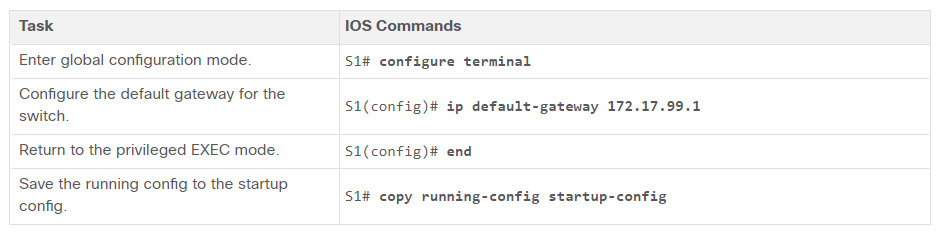

# 1.1.6 Switch SVI Configuration Example

## Step 1

### Configure the Management Interface


## Step 2

### Configure the Default Gateway



## Step 3

### Verify Configuration

The show ip interface brief and show ipv6 interface brief commands are useful for determining the status of both physical and virtual interfaces. The output shown confirms that interface VLAN 99 has been configured with an IPv4 and IPv6 address.

```
S1# show ip interface brief
Interface     IP-Address     OK? Method   Status    Protocol
Vlan99        172.17.99.11   YES manual   down      down
(output omitted)
S1# show ipv6 interface brief
Vlan99                 [down/down]
    FE80::C27B:BCFF:FEC4:A9C1
    2001:DB8:ACAD:99::11
(output omitted)
```

### 1.2.1 Duplex Communication

**Full-duplex communication** increases bandwidth efficiency by allowing both ends of a connection to transmit and receive data simultaneously. This is also known as bidirectional communication and it requires microsegmentation. A microsegmented LAN is created when a switch port has only one device connected and is operating in full-duplex mode. There is no collision domain associated with a switch port operating in full-duplex mode.

Unlike full-duplex communication, half-duplex communication is unidirectional. 

**Half-duplex** communication creates performance issues because data can flow in only one direction at a time, often resulting in collisions. Half-duplex connections are typically seen in older hardware, such as hubs. Half-duplex hubs have been replaced by switches that use full-duplex communications by default.


### 1.2.4 Switch Verification Commands


### 1.3.2 SSH Operation

Secure Shell (SSH) is a secure protocol that uses TCP port 22. It provides a secure (encrypted) management connection to a remote device. SSH should replace Telnet for management connections. SSH provides security for remote connections by providing strong encryption when a device is authenticated (username and password) and also for the transmitted data between the communicating devices.

### 1.3.4 Configure SSH

### Step 1 Verify SSH support.

Use the show ip ssh command to verify that the switch supports SSH. If the switch is not running an IOS that supports cryptographic features, this command is unrecognized.
```
S1# show ip ssh
```

### Step 2 Configure the IP domain.

Configure the IP domain name of the network using the ip domain-name domain-name global configuration mode command. In the figure, the domain-name value is cisco.com.
```
S1(config)# ip domain-name cisco.com
```

### Step 3 Generate RSA key pairs.

Not all versions of the IOS default to SSH version 2, and SSH version 1 has known security flaws. To configure SSH version 2, issue the ip ssh version 2 global configuration mode command. Generating an RSA key pair automatically enables SSH. Use the crypto key generate rsa global configuration mode command to enable the SSH server on the switch and generate an RSA key pair. When generating RSA keys, the administrator is prompted to enter a modulus length. The sample configuration in the figure uses a modulus size of 1,024 bits. A longer modulus length is more secure, but it takes longer to generate and to use.

Note: To delete the RSA key pair, use the crypto key zeroize rsa global configuration mode command. After the RSA key pair is deleted, the SSH server is automatically disabled.
```
S1(config)# crypto key generate rsa
How many bits in the modulus [512]: 1024
```

### Step 4 Configure user authentication.

The SSH server can authenticate users locally or using an authentication server. To use the local authentication method, create a username and password pair using the username username secret password global configuration mode command. In the example, the user admin is assigned the password ccna.

```
S1(config)# username admin secret ccna
```

### Step 5 Configure the vty lines.


Enable the SSH protocol on the vty lines by using the transport input ssh line configuration mode command. The Catalyst 2960 has vty lines ranging from 0 to 15. This configuration prevents non-SSH (such as Telnet) connections and limits the switch to accept only SSH connections. Use the line vty global configuration mode command and then the login local line configuration mode command to require local authentication for SSH connections from the local username database.
```
S1(config)# line vty 0 15
S1(config-line)# transport input ssh
S1(config-line)# login local
S1(config-line)# exit
```

### Step 6 Enable SSH version 2.

By default, SSH supports both versions 1 and 2. When supporting both versions, this is shown in the show ip ssh output as supporting version 2. Enable SSH version using the ip ssh version 2 global configuration command.
```
S1(config)# ip ssh version 2
```

### 1.4.4 Configure Router Interfaces

To be available, an interface must be:

* **Configured with at least one IP address** - Use the ip address ip-address subnet-mask and the ipv6 address ipv6-address/prefix interface configuration commands.
* **Activated** - By default, LAN and WAN interfaces are not activated (shutdown). To enable an interface, it must be activated using the no shutdown command. (This is similar to powering on the interface.) The interface must also be connected to another device (a hub, a switch, or another router) for the physical layer to be active.
* **Description** - Optionally, the interface could also be configured with a short description of up to 240 characters. It is good practice to configure a description on each interface. On production networks, the benefits of interface descriptions are quickly realized as they are helpful in troubleshooting and in identifying a third-party connection and contact information.


The following example shows the configuration for the interfaces on R1.
````
R1(config)# interface gigabitethernet 0/0/0
R1(config-if)# ip address 192.168.10.1 255.255.255.0 
R1(config-if)# ipv6 address 2001:db8:acad:1::1/64 
R1(config-if)# description Link to LAN 1
R1(config-if)# no shutdown
R1(config-if)# exit
R1(config)# interface gigabitethernet 0/0/1
R1(config-if)# ip address 192.168.11.1 255.255.255.0 
R1(config-if)# ipv6 address 2001:db8:acad:2::1/64 
R1(config-if)# description Link to LAN 2
R1(config-if)# no shutdown
R1(config-if)# exit
R1(config)# interface serial 0/0/0
R1(config-if)# ip address 209.165.200.225 255.255.255.252 
R1(config-if)# ipv6 address 2001:db8:acad:3::225/64 
R1(config-if)# description Link to R2
R1(config-if)# no shutdown
R1(config-if)# exit
R1(config)#
````

### 1.4.6 IPv4 Loopback Interfaces


The loopback interface is a logical interface that is internal to the router. It is not assigned to a physical port and can never be connected to any other device. It is considered a software interface that is automatically placed in an “up” state, as long as the router is functioning.

The loopback interface is useful in testing and managing a Cisco IOS device because it ensures that at least one interface will always be available. For example, it can be used for testing purposes, such as testing internal routing processes, by emulating networks behind the router.

Enabling and assigning a loopback address is simple:
````
Router(config)# interface loopback number 
Router(config-if)# ip address ip-address subnet-mask 
````
Multiple loopback interfaces can be enabled on a router. The IPv4 address for each loopback interface must be unique and unused by any other interface, as shown in the example configuration of loopback interface 0 on R1.
````
R1(config)# interface loopback 0
R1(config-if)# ip address 10.0.0.1 255.255.255.0
R1(config-if)# exit
R1(config)#
%LINEPROTO-5-UPDOWN: Line protocol on Interface Loopback0, changed state to up
````


