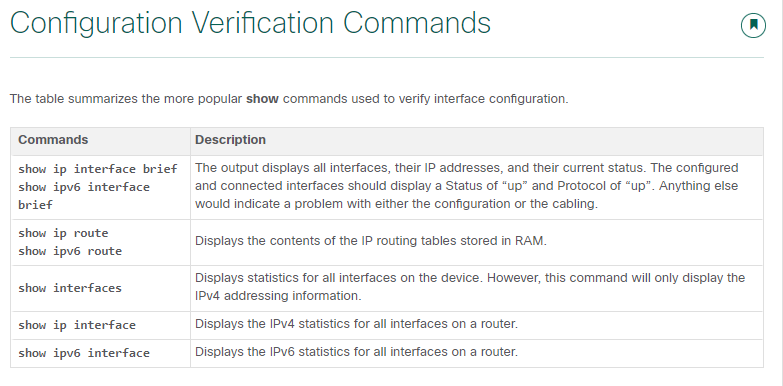

### 10.1.1 Basic Router Configuration Steps

1. Configure the device name.
```
Router(config)# hostname hostname
```
2. Secure privileged EXEC mode.
```
Router(config)# enable secret password
```
3. Secure user EXEC mode.
```
Router(config)# line console 0
Router(config-line)# password password
Router(config-line)# login
```
4. Secure remote Telnet / SSH access.
```
Router(config-line)# line vty 0 4
Router(config-line)# password password
Router(config-line)# login
Router(config-line)# transport input {ssh | telnet}
```
5. Secure all passwords in the config file.
```
Router(config-line)# exit
Router(config)# service password-encryption
```
6. Provide legal notification.
```
Router(config)# banner motd delimiter message delimiter
```
7. Save the configuration.
```
Router(config)# end
Router# copy running-config startup-config
```

### 10.2.1 Configure Router Interfaces
At this point, your routers have their basic configurations. The next step is to configure their interfaces. This is because routers are not reachable by end devices until the interfaces are configured. 

```
Router(config)# interface type-and-number
Router(config-if)# description description-text
Router(config-if)# ip address ipv4-address subnet-mask
Router(config-if)# ipv6 address ipv6-address/prefix-length
Router(config-if)# no shutdown
```
Note: When a router interface is enabled, information messages should be displayed confirming the enabled link.

Although the description command is not required to enable an interface, it is good practice to use it. It can be helpful in troubleshooting on production networks by providing information about the type of network connected. For example, if the interface connects to an ISP or service carrier, the description command would be helpful to enter the third-party connection and contact information.

Note: The description-text is limited to 240 characters.

Using the no shutdown command activates the interface and is similar to powering on the interface. The interface must also be connected to another device, such as a switch or a router, for the physical layer to be active.

**Note**: On inter-router connections where there is no Ethernet switch, both interconnecting interfaces must be configured and enabled.

### 10.2.4 Configuration Verification Commands
The table summarizes the more popular show commands used to verify interface configuration.



----
To configure an IPv4 default gateway on a switch, use the ip default-gateway ip-address global configuration command. The ip-address that is configured is the IPv4 address of the local router interface connected to the switch.