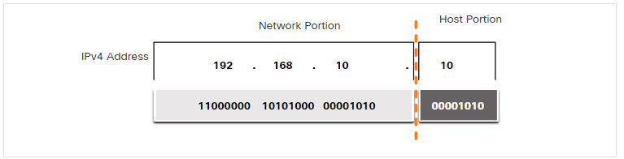
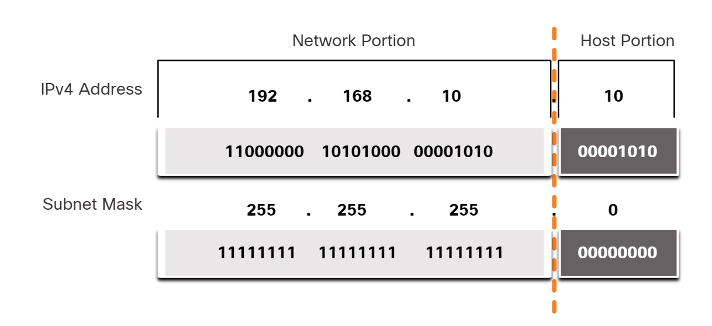
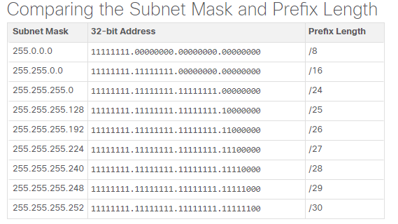
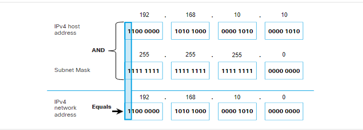
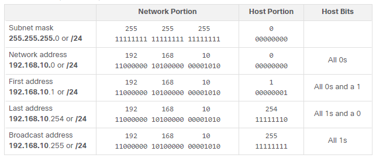

## 11.1 IPv4 Addresss Structure

The bits within the network portion of the address must be identical for all devices that reside in the same network. The bits within the host portion of the address must be unique to identify a specific host within a network. 

**To know which portion of the 32-bit identifies the network and which the host we have:**

### 11.1.2 The Subnet Mask

The IPv4 subnet mask is used to differentiate the network portion from the host portion of an IPv4 address. When an IPv4 address is assigned to a device, the subnet mask is used to determine the network address of the device. The network address represents all the devices on the same network.

### 11.1.3 The Prefix Length

The prefix length is the number of bits set to 1 in the subnet mask. It is written in “slash notation”, which is noted by a forward slash (/) followed by the number of bits set to 1. Therefore, count the number of bits in the subnet mask and prepend it with a slash.

### 11.1.4 Determining the Network: Logical AND

To identify the network address of an IPv4 host, the IPv4 address is logically ANDed, bit by bit, with the subnet mask. ANDing between the address and the subnet mask yields the network address.

To illustrate how AND is used to discover a network address, consider a host with IPv4 address 192.168.10.10 and subnet mask of 255.255.255.0, as shown in the figure:

* IPv4 host address (192.168.10.10) - The IPv4 address of the host in dotted decimal and binary formats.
* Subnet mask (255.255.255.0) - The subnet mask of the host in dotted decimal and binary formats.
* Network address (192.168.10.0) - The logical AND operation between the IPv4 address and subnet mask results in an IPv4 network address shown in dotted decimal and binary formats.

### 11.1.6 Network, Host, and Broadcast Addresses

### Network address

A network address is an address that represents a specific network. A device belongs to this network if it meets three criteria:

* It has the same subnet mask as the network address.
* It has the same network bits as the network address, as indicated by the subnet mask.
* It is located on the same broadcast domain as other hosts with the same network address.
* A host determines its network address by performing an AND operation between its IPv4 address and its subnet mask.

### Host addresses

Host addresses are addresses that can be assigned to a device such as a host computer, laptop, smart phone, web camera, printer, router, etc. The host portion of the address is the bits indicated by 0 bits in the subnet mask. Host addresses can have any combination of bits in the host portion except for all 0 bits (this would be a network address) or all 1 bits (this would be a broadcast address).

All devices within the same network, must have the same subnet mask and the same network bits. Only the host bits will differ and must be unique.

Notice that in the table, there is a first and last host address:

* **First host address** - This first host within a network has all 0 bits with the last (right-most) bit as a 1 bit. In this example it is 192.168.10.1/24.
* **Last host address** - This last host within a network has all 1 bits with the last (right-most) bit as a 0 bit. In this example it is 192.168.10.254/24.
Any addresses between and including, 192.168.10.1/24 through 192.168.10.254/24 can be assigned to a device on the network.

### Broadcast address

A broadcast address is an address that is used when it is required to reach all devices on the IPv4 network. As shown in the table, the network broadcast address has all 1 bits in the host portion, as determined by the subnet mask. In this example, the network address is 192.168.10.255/24. A broadcast address cannot be assigned to a device.
