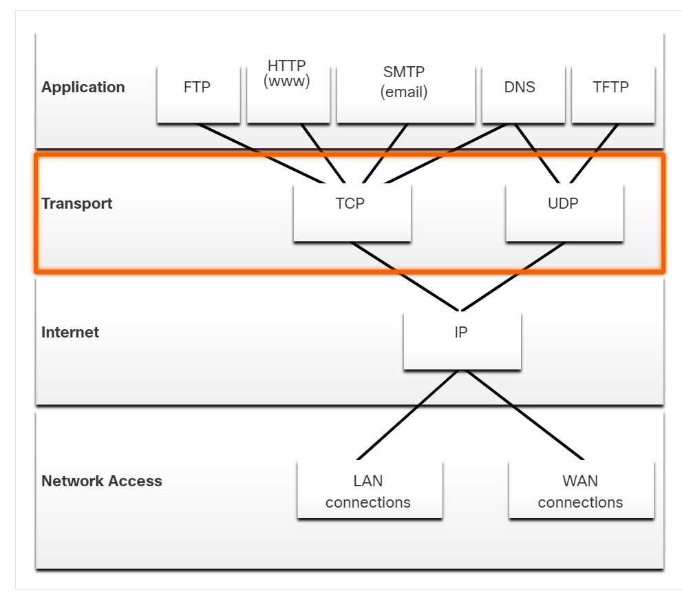

The transport layer is responsible for logical communications between applications running on different hosts. This may include services such as establishing a temporary session between two hosts and the reliable transmission of information for an application.

### 14.1.3 Transport Layer Protocols

Transport layer protocols specify how to transfer messages between hosts, and are responsible for managing reliability requirements of a conversation. The transport layer includes the TCP and UDP protocols.

Different applications have different transport reliability requirements. Therefore, TCP/IP provides two transport layer protocols, as shown in the figure.

### 14.1.4 Transmission Control Protocol (TCP)
IP is concerned only with the structure, addressing, and routing of packets, from original sender to final destination. IP is not responsible for guaranteeing delivery or determining whether a connection between the sender and receiver needs to be established.

TCP is considered a **reliable, full-featured transport layer protocol, which ensures that all of the data arrives at the destination.** TCP includes fields which ensure the delivery of the application data. These fields require additional processing by the sending and receiving hosts.

Note: TCP divides data into segments.

TCP transport is analogous to sending packages that are tracked from source to destination. If a shipping order is broken up into several packages, a customer can check online to see the order of the delivery.

TCP provides reliability and flow control using these basic operations:

* Number and track data segments transmitted to a specific host from a specific application
* Acknowledge received data
* Retransmit any unacknowledged data after a certain amount of time
* Sequence data that might arrive in wrong order
* Send data at an efficient rate that is acceptable by the receiver

In order to maintain the state of a conversation and track the information, TCP must first establish a connection between the sender and the receiver. This is why TCP is known as a connection-oriented protocol.

Skip to content
Transport Layer
Transportation of Data
Transportation of Data

14.1.1
Role of the Transport Layer
Application layer programs generate data that must be exchanged between source and destination hosts. The transport layer is responsible for logical communications between applications running on different hosts. This may include services such as establishing a temporary session between two hosts and the reliable transmission of information for an application.

As shown in the figure, the transport layer is the link between the application layer and the lower layers that are responsible for network transmission.

shows a diagram of how devices use the transport layer to move data between applications in the TCP/IP model

The transport layer moves data between applications on devices in the network.ApplicationTransportNetwork AccessTCP/IP ModelApplicationTransportInternetNetwork AccessTCP/IP ModelInternet
The transport layer has no knowledge of the destination host type, the type of media over which the data must travel, the path taken by the data, the congestion on a link, or the size of the network.

The transport layer includes two protocols:

Transmission Control Protocol (TCP)
User Datagram Protocol (UDP)

14.1.2
Transport Layer Responsibilities
The transport layer has many responsibilities.

Select each tab for more information.

Tracking Individual Conversations

Segmenting Data and Reassembling Segments

Add Header Information

Identifying the Applications

Conversation Multiplexing
Tracking Individual Conversations

At the transport layer, each set of data flowing between a source application and a destination application is known as a conversation and is tracked separately. It is the responsibility of the transport layer to maintain and track these multiple conversations.

As illustrated in the figure, a host may have multiple applications that are communicating across the network simultaneously.

Most networks have a limitation on the amount of data that can be included in a single packet. Therefore, data must be divided into manageable pieces.

The PC simultaneously runs multiple network applications including an email client, instant messaging client, web browser web pages, streaming video, and a video conference client.

To: you@example.com
From: me@example.com
Subject: VacationEmailOnline Video ChattingStreaming VideoMultiple Web PagesInstant MessagingNetwork

14.1.3
Transport Layer Protocols
IP is concerned only with the structure, addressing, and routing of packets. IP does not specify how the delivery or transportation of the packets takes place.

Transport layer protocols specify how to transfer messages between hosts, and are responsible for managing reliability requirements of a conversation. The transport layer includes the TCP and UDP protocols.

Different applications have different transport reliability requirements. Therefore, TCP/IP provides two transport layer protocols, as shown in the figure.

shows how application layer protocols like FTP, HTTP, SMTP use TCP at the transport layer and DNS and TFTP use UDP. How they all use IP at the internet layer regardless of whether they connect to a LAN or a WAN at the network access layer

ApplicationTransportInternetNetwork AccessFTPHTTP
(www)SMTP
(email)DNSTFTPTCPUDPIPLAN
connectionsWAN
connections

14.1.4
Transmission Control Protocol (TCP)
IP is concerned only with the structure, addressing, and routing of packets, from original sender to final destination. IP is not responsible for guaranteeing delivery or determining whether a connection between the sender and receiver needs to be established.

TCP is considered a reliable, full-featured transport layer protocol, which ensures that all of the data arrives at the destination. TCP includes fields which ensure the delivery of the application data. These fields require additional processing by the sending and receiving hosts.

Note: TCP divides data into segments.

TCP transport is analogous to sending packages that are tracked from source to destination. If a shipping order is broken up into several packages, a customer can check online to see the order of the delivery.

TCP provides reliability and flow control using these basic operations:

Number and track data segments transmitted to a specific host from a specific application
Acknowledge received data
Retransmit any unacknowledged data after a certain amount of time
Sequence data that might arrive in wrong order
Send data at an efficient rate that is acceptable by the receiver
In order to maintain the state of a conversation and track the information, TCP must first establish a connection between the sender and the receiver. This is why TCP is known as a connection-oriented protocol.

Click Play in the figure to see how TCP segments and acknowledgments are transmitted between sender and receiver.

The animation shows a connection to an FTP server initiated with a TCP 3-way handshake and the data segments being accounted for by using sequence numbers and acknowledgements

A file is sent to a server using the File Transfer Protocol (FTP) application. TCP tracks the conversation and divides the data to be sent into 6 segments.The first 3 out of 6 segments are forwarded to the server.The file server acknowledges the first 3 segments received.The client forwards the next 3 segments.No segments are received, no acknowledgement is sent.The client resends the final 3 segments.The final 3 segments are received and acknowledged.ISP 1FTPServer FarmInternetISP 2

### 14.1.5 User Datagram Protocol (UDP)
UDP is a simpler transport layer protocol than TCP. It does not provide reliability and flow control, which means it requires fewer header fields. Because the sender and the receiver UDP processes do not have to manage reliability and flow control, this means UDP datagrams can be processed faster than TCP segments. UDP provides the basic functions for delivering datagrams between the appropriate applications, with very little overhead and data checking.

Note: UDP divides data into datagrams that are also referred to as segments.

UDP is a connectionless protocol. Because UDP does not provide reliability or flow control, it does not require an established connection. Because UDP does not track information sent or received between the client and server, UDP is also known as a stateless protocol.

UDP is also known as a best-effort delivery protocol because there is no acknowledgment that the data is received at the destination. With UDP, there are no transport layer processes that inform the sender of a successful delivery.

UDP is like placing a regular, nonregistered, letter in the mail. The sender of the letter is not aware of the availability of the receiver to receive the letter. Nor is the post office responsible for tracking the letter or informing the sender if the letter does not arrive at the final destination.
