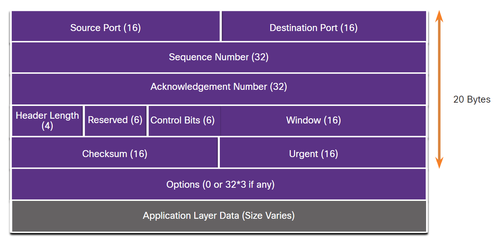

### 14.2.1 TCP Features

In addition to supporting the basic functions of data segmentation and reassembly, TCP also provides the following services:

* Establishes a Session - TCP is a connection-oriented protocol that negotiates and establishes a permanent connection (or session) between source and destination devices prior to forwarding any traffic. Through session establishment, the devices negotiate the amount of traffic that can be forwarded at a given time, and the communication data between the two can be closely managed.
* Ensures Reliable Delivery - For many reasons, it is possible for a segment to become corrupted or lost completely, as it is transmitted over the network. TCP ensures that each segment that is sent by the source arrives at the destination.
* Provides Same-Order Delivery - Because networks may provide multiple routes that can have different transmission rates, data can arrive in the wrong order. By numbering and sequencing the segments, TCP ensures segments are reassembled into the proper order.
* Supports Flow Control - Network hosts have limited resources (i.e., memory and processing power). When TCP is aware that these resources are overtaxed, it can request that the sending application reduce the rate of data flow. This is done by TCP regulating the amount of data the source transmits. Flow control can prevent the need for retransmission of the data when the resources of the receiving host are overwhelmed.

### 14.2.3 TCP Header Fields

### Aplications
* http
* ftp
* smtp
* ssh

### 14.3.1 UDP Features
 UDP is a lightweight transport protocol that offers the same data segmentation and reassembly as TCP, but without TCP reliability and flow control.

UDP is such a simple protocol that it is usually described in terms of what it does not do compared to TCP.

UDP features include the following:

* Data is reconstructed in the order that it is received.
* Any segments that are lost are not resent.
* There is no session establishment.
* The sending is not informed about resource availability.

### 14.3.2 UDP Header

UDP is a stateless protocol, meaning neither the client, nor the server, tracks the state of the communication session. If reliability is required when using UDP as the transport protocol, it must be handled by the application.

One of the most important requirements for delivering live video and voice over the network is that the data continues to flow quickly. Live video and voice applications can tolerate some data loss with minimal or no noticeable effect, and are perfectly suited to UDP.

The blocks of communication in UDP are called datagrams, or segments. These datagrams are sent as best effort by the transport layer protocol.

The UDP header is far simpler than the TCP header because it only has four fields and requires 8 bytes.

|UDP Header Field|Description                                                                |
|----------------|---------------------------------------------------------------------------|
|Source Port     |A 16-bit field used to identify the source application by port number.     |
|Destination Port|A 16-bit field used to identify the destination application by port number.|
|Length          |A 16-bit field that indicates the length of the UDP datagram header.       |
|Checksum        |A 16-bit field used for error checking of the datagram header and data.    |

### 14.3.4 Applications that use UDP
There are three types of applications that are best suited for UDP:

* Live video and multimedia applications - These applications can tolerate some data loss, but require little or no delay. Examples include VoIP and live streaming video.
* Simple request and reply applications - Applications with simple transactions where a host sends a request and may or may not receive a reply. Examples include DNS and DHCP.
* Applications that handle reliability themselves - Unidirectional communications where flow control, error detection, acknowledgments, and error recovery is not required, or can be handled by the application. Examples include SNMP and TFTP.

### 14.4.2 Socket Pairs (ports)
The source and destination ports are placed within the segment. The segments are then encapsulated within an IP packet. The IP packet contains the IP address of the source and destination. The combination of the source IP address and source port number, or the destination IP address and destination port number is known as a socket.

In the example in the figure, the PC is simultaneously requesting FTP and web services from the destination server.

The figure depicts a PC making both an FTP connection and a web connection to a server. The requests have source and destination port numbers which identify the host PC and the requested application service respectively.

