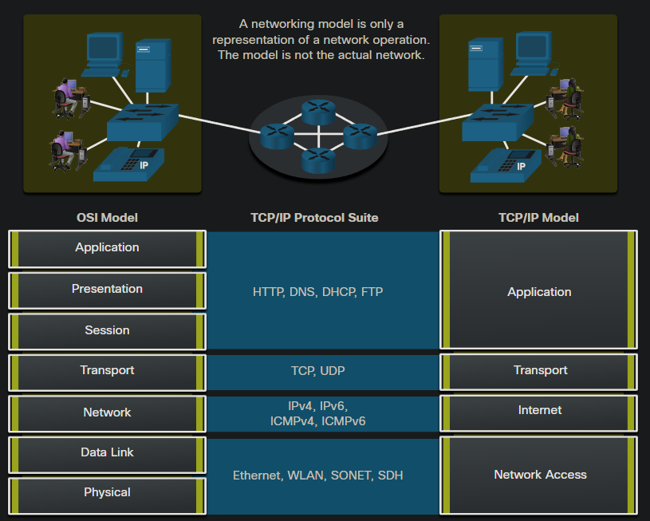
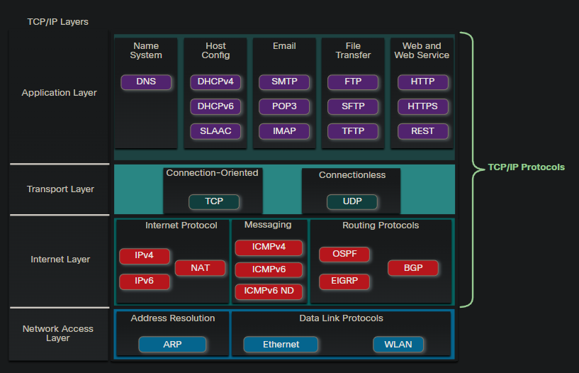
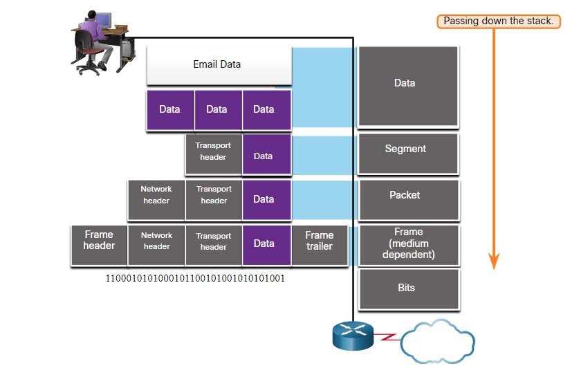
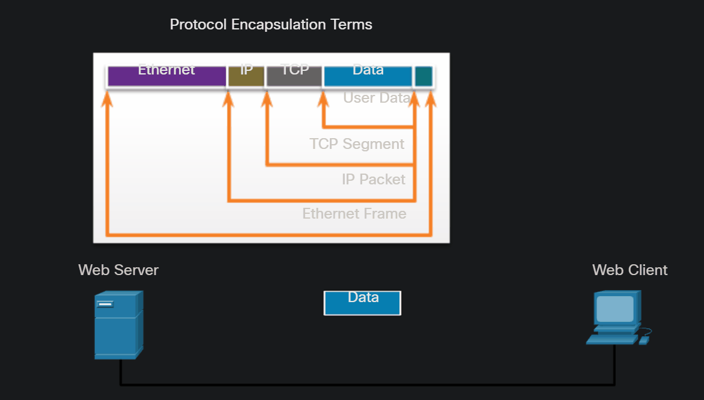
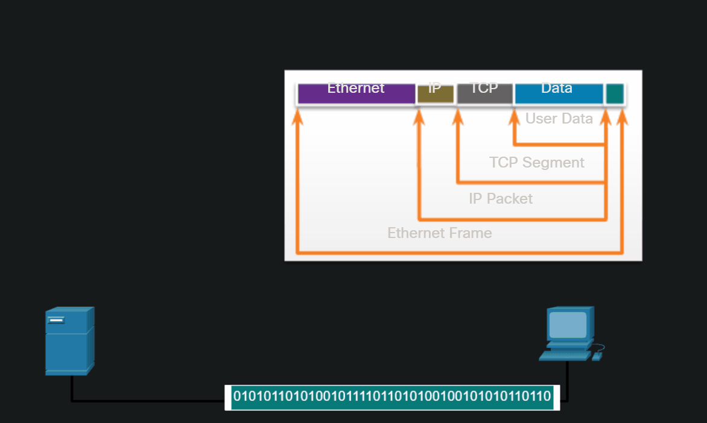
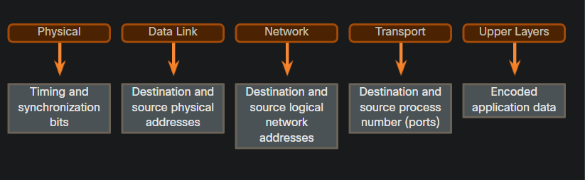
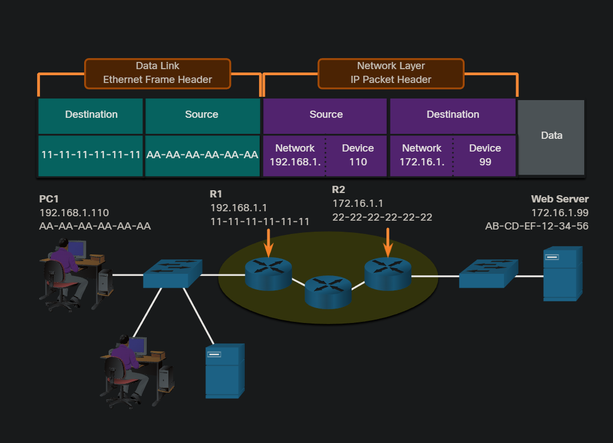

# 3. Protocols and Models
## 3.1 The Rules
For end devices to be able to communicate over a network, each device must abide by the same set of rules, these rules are called **protocols**.

### 3.2.1 Protocol Type	Description
* **Network Communications Protocols**:	
Protocols enable two or more devices to communicate over one or more networks. The Ethernet family of technologies involves a variety of protocols such as:
    - IP. 
    - Transmission Control Protocol (TCP).
    - HyperText Transfer Protocol (HTTP).

* **Network Security Protocols**: Protocols secure data to provide authentication, data integrity, and data encryption. 
    * Secure Shell (SSH)
    * Secure Sockets Layer (SSL)
    * Transport Layer Security (TLS).

* **Routing Protocols**: Protocols enable routers to exchange route information, compare path information, and then to select the best path to the destination network. 
    * Open Shortest Path First (OSPF) 
    * Border Gateway Protocol (BGP).

* **Service Discovery Protocols**:	Protocols are used for the automatic detection of devices or services.  
    * **Dynamic Host Configuration Protocol (DHCP)**: discovers services for IP address allocation.
    * **Domain Name System (DNS)**: used to perform name-to-IP address translation.

### 3.2.2 Network Protocol Functions 

* **Addressing**:
	This identifies the sender and the intended receiver of the message using a defined addressing scheme. 

* **Reliability**:	This function provides guaranteed delivery mechanisms in case messages are lost or corrupted in transit. 

* **Flow control**:	This function ensures that data flows at an efficient rate between two communicating devices. 

* **Sequencing**: This function uniquely labels each transmitted segment of data. The receiving device uses the sequencing information to reassemble the information correctly. This is useful if the data segments are lost, delayed or received out-of-order. 
* **Error Detection**: This function is used to determine if data became corrupted during transmission.

* **Application Interface**:	This function contains information used for process-to-process communications between network applications.

### 3.2.3 Protocol Interaction

* **Hypertext Transfer Protocol (HTTP)** - This protocol governs the way a web server and a web client interact. HTTP defines the content and formatting of the requests and responses that are exchanged between the client and server. Both the client and the web server software implement HTTP as part of the application. HTTP relies on other protocols to govern how the messages are transported between the client and server( **Application Interface**).

* **Transmission Control Protocol (TCP)** - This protocol manages the individual conversations. TCP is responsible for guaranteeing the reliable(**Reliability**) delivery of the information and managing **flow control** between the end devices. Has the **Sequencing** function as  well as **Error Detection**.

* **Internet Protocol (IP)** - This protocol is responsible for delivering messages from the sender to the receiver. IP is used by routers to forward the messages across multiple networks. Has the **Addressing** function and includes **Error Detection**

* **Ethernet** - This protocol is responsible for the delivery of messages from one NIC to another NIC on the same Ethernet local area network (LAN). Has the **Addressing** function and includes **Error Detection**

## 3.5 Reference Models
### 3.5.2 The OSI Reference Model
The OSI reference model provides an extensive list of functions and services that can occur at each layer. This type of model provides consistency within all types of network protocols and services by describing what must be done at a particular layer, but not prescribing how it should be accomplished.

It also describes the interaction of each layer with the layers directly above and below.

|OSI Model Layer |Description                                                                                                                                                                                                        |
|----------------|-------------------------------------------------------------------------------------------------------------------------------------------------------------------------------------------------------------------|
|7 - Application |The application layer contains protocols used for process-to-process communications.                                                                                                                               |
|6 - Presentation|The presentation layer provides for common representation of the data transferred between application layer services.                                                                                              |
|5 - Session     |The session layer provides services to the presentation layer to organize its dialogue and to manage data exchange.                                                                                                |
|4 - Transport   |The transport layer defines services to segment, transfer, and reassemble the data for individual communications between the end devices.                                                                          |
|3 - Network     |The network layer provides services to exchange the individual pieces of data over the network between identified end devices.                                                                                     |
|2 - Data Link   |The data link layer protocols describe methods for exchanging data frames between devices over a common media                                                                                                      |
|1 - Physical    |The physical layer protocols describe the mechanical, electrical, functional, and procedural means to activate, maintain, and de-activate physical connections for a bit transmission to and from a network device.|

### 3.5.3 The TCP/IP Protocol Model

The TCP/IP model is a protocol model because it describes the functions that occur at each layer of protocols within the TCP/IP suite. TCP/IP is also used as a reference model. The table shows details about each layer of the OSI model.

|TCP/IP Model Layer|Description                                                            |
|------------------|-----------------------------------------------------------------------|
|4 - Application   |Represents data to the user, plus encoding and dialog control.         |
|3 - Transport     |Supports communication between various devices across diverse networks.|
|2 - Internet      |Determines the best path through the network.                          |
|1 - Network Access|Controls the hardware devices and media that make up the network.      |

### 3.5.4 OSI and TCP/IP Model Comparison

The protocols that make up the TCP/IP protocol suite can also be described in terms of the OSI reference model. In the OSI model, the network access layer and the application layer of the TCP/IP model are further divided to describe discrete functions that must occur at these layers.

At the network access layer, the TCP/IP protocol suite does not specify which protocols to use when transmitting over a physical medium; it only describes the handoff from the internet layer to the physical network protocols. OSI Layers 1 and 2 discuss the necessary procedures to access the media and the physical means to send data over a network.

The key similarities are in the transport and network layers; however, the two models differ in how they relate to the layers above and below each layer:

OSI Layer 3, the network layer, maps directly to the TCP/IP internet layer. This layer is used to describe protocols that address and route messages through an internetwork.
OSI Layer 4, the transport layer, maps directly to the TCP/IP transport layer. This layer describes general services and functions that provide ordered and reliable delivery of data between source and destination hosts.
The TCP/IP application layer includes several protocols that provide specific functionality to a variety of end user applications. The OSI model Layers 5, 6, and 7 are used as references for application software developers and vendors to produce applications that operate on networks.
Both the TCP/IP and OSI models are commonly used when referring to protocols at various layers. Because the OSI model separates the data link layer from the physical layer, it is commonly used when referring to these lower layers.

## 3.3 Protocol Suites
### 3.3.4 TCP/IP Protocol Suite
  

### Application Layer

* Name System

    * DNS - Domain Name System. Translates domain names such as cisco.com, into IP addresses.

* Host Config

    * DHCPv4 - Dynamic Host Configuration Protocol for IPv4. A DHCPv4 server dynamically assigns IPv4 addressing information to DHCPv4 clients at start-up and allows the addresses to be re-used when no longer needed.
    * DHCPv6 - Dynamic Host Configuration Protocol for IPv6. DHCPv6 is similar to DHCPv4. A DHCPv6 server dynamically assigns IPv6 addressing information to DHCPv6 clients at start-up.
    * SLAAC - Stateless Address Autoconfiguration. A method that allows a device to obtain its IPv6 addressing information without using a DHCPv6 server.

* Email

    * SMTP - Simple Mail Transfer Protocol. Enables clients to send email to a mail server and enables servers to send email to other servers.
    * POP3 - Post Office Protocol version 3. Enables clients to retrieve email from a mail server and download the email to the client's local mail application.
    * IMAP - Internet Message Access Protocol. Enables clients to access email stored on a mail server as well as maintaining email on the server.

* File Transfer

    * FTP - File Transfer Protocol. Sets the rules that enable a user on one host to access and transfer files to and from another host over a network. FTP is a reliable, connection-oriented, and acknowledged file delivery protocol.
    * SFTP - SSH File Transfer Protocol. As an extension to Secure Shell (SSH) protocol, SFTP can be used to establish a secure file transfer session in which the file transfer is encrypted. SSH is a method for secure remote login that is typically used for accessing the command line of a device.
    * TFTP - Trivial File Transfer Protocol. A simple, connectionless file transfer protocol with best-effort, unacknowledged file delivery. It uses less overhead than FTP.

* Web and Web Service

    * HTTP - Hypertext Transfer Protocol. A set of rules for exchanging text, graphic images, sound, video, and other multimedia files on the World Wide Web.
    * HTTPS - HTTP Secure. A secure form of HTTP that encrypts the data that is exchanged over the World Wide Web.
    * REST - Representational State Transfer. A web service that uses application programming interfaces (APIs) and HTTP requests to create web applications.

### Transport layer

* Connection-Oriented

    * TCP - Transmission Control Protocol. Enables reliable communication between processes running on separate hosts and provides reliable, acknowledged transmissions that confirm successful delivery.
    Connectionless

    * UDP - User Datagram Protocol. Enables a process running on one host to send packets to a process running on another host. However, UDP does not confirm successful datagram transmission.

### Internet Layer

* Internet Protocol

    * IPv4 - Internet Protocol version 4. Receives message segments from the transport layer, packages messages into packets, and addresses packets for end-to-end delivery over a network. IPv4 uses a 32-bit address.
    * IPv6 - IP version 6. Similar to IPv4 but uses a 128-bit address.
    * NAT - Network Address Translation. Translates IPv4 addresses from a private network into globally unique public IPv4 addresses.
* Messaging

    * ICMPv4 - Internet Control Message Protocol for IPv4. Provides feedback from a destination host to a source host about errors in packet delivery.
    * ICMPv6 - ICMP for IPv6. Similar functionality to ICMPv4 but is used for IPv6 packets.
    * ICMPv6 ND - ICMPv6 Neighbor Discovery. Includes four protocol messages that are used for address resolution and duplicate address detection.
* Routing Protocols

    * OSPF - Open Shortest Path First. Link-state routing protocol that uses a hierarchical design based on areas. OSPF is an open standard interior routing protocol.
    * EIGRP - EIGRP - Enhanced Interior Gateway Routing Protocol. An open standard routing protocol developed by Cisco that uses a composite metric based on bandwidth, delay, load and reliability.
    * BGP - Border Gateway Protocol. An open standard exterior gateway routing protocol used between Internet Service Providers (ISPs). BGP is also commonly used between ISPs and their large private clients to exchange routing information.
### Network Access Layer

* Address Resolution

    * ARP - Address Resolution Protocol. Provides dynamic address mapping between an IPv4 address and a hardware address.

        **Note**: You may see other documentation state that ARP operates at the Internet Layer (OSI Layer 3). However, in this course we state that ARP operates at the Network Access layer (OSI Layer 2) because it's primary purpose is the discover the MAC address of the destination. A MAC address is a Layer 2 address.

* Data Link Protocols

    * Ethernet - Defines the rules for wiring and signaling standards of the network access layer.
    * WLAN - Wireless Local Area Network. Defines the rules for wireless signaling across the 2.4 GHz and 5 GHz radio frequencies.

## 3.6 Data Encapsulation
### 3.6.3 Protocol Data Units

**Data** - The general term for the PDU used at the application layer

**Segment** - Transport layer PDU

**Packet** - Network layer PDU

**Frame** - Data Link layer PDU

**Bits** - Physical layer PDU used when physically transmitting data over the medium

**Note**: If the Transport header is TCP, then it is a segment. If the Transport header is UDP then it is a datagram.

  

### 3.6.4 Encapsulation Example
  

### 3.6.5 De-Encapsulation Example
  

## 3.7 Data Access

### 3.7.1 Addresses

The network and data link layers are responsible for delivering the data from the source device to the destination device. Protocols at both layers contain a source and destination address, but their addresses have different purposes:

* Network layer source and destination addresses - Responsible for delivering the IP packet from the original source to the final destination, which may be on the same network or a remote network.

* Data link layer source and destination addresses - Responsible for delivering the data link frame from one network interface card (NIC) to another NIC on the same network.

### 3.7.2 Layer 3 Logical Address
An IP address is the network layer, or Layer 3, logical address used to deliver the IP packet from the original source to the final destination.

An IP address contains two parts:

* Network portion (IPv4) or Prefix (IPv6) - The left-most part of the address that indicates the network in which the IP address is a member. All devices on the same network will have the same network portion of the address.
* Host portion (IPv4) or Interface ID (IPv6) - The remaining part of the address that identifies a specific device on the network. This portion is unique for each device or interface on the network.
Note: The subnet mask (IPv4) or prefix-length (IPv6) is used to identify the network portion of an IP address from the host portion.

### 3.7.6 Role of the Network Layer Addresses

Example:

* Source IPv4 address - The IPv4 address of the sending device, the client computer PC1: 192.168.1.110.
* Destination IPv4 address - The IPv4 address of the receiving device, the server, Web Server: 172.16.1.99.

Notice in the figure that the network portion of the source IPv4 address and destination IPv4 address are on different networks.

