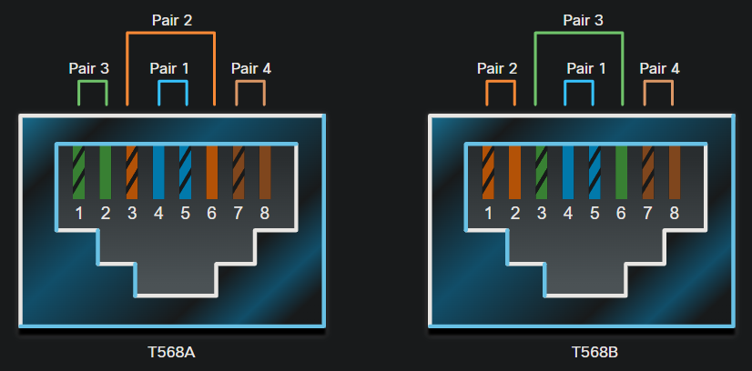
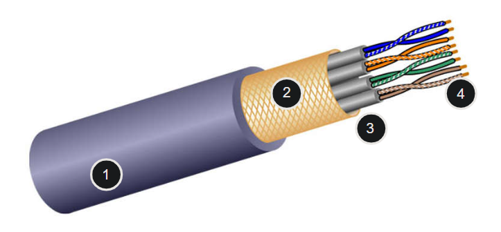
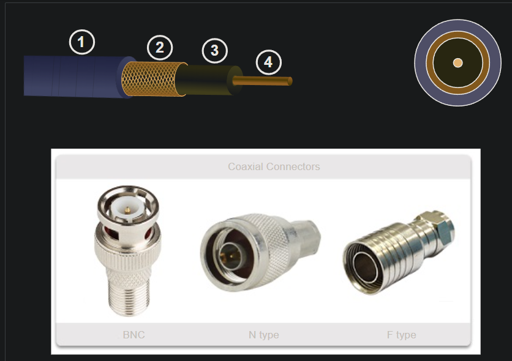

# 4.0 Physical Layer

The OSI physical layer provides the means to transport the bits that make up a data link layer frame across the network media.

## 4.2 Physical Layer Characteristics
### 4.2.2 Physical Components

The physical components are the electronic hardware devices, media, and other connectors that transmit the signals that represent the bits. Hardware components such as NICs, interfaces and connectors, cable materials, and cable designs.

### 4.2.3 Encoding

Encoding or line encoding is a method of converting a stream of data bits into a predefined "code”. Codes are groupings of bits used to provide a predictable pattern that can be recognized by both the sender and the receiver.

**Encoding is the method or pattern used to represent digital information**
### 4.2.4 Signaling
The physical layer must generate the electrical, optical, or wireless signals that represent the "1" and "0" on the media. The way that bits are represented is called the signaling method. The physical layer standards must define what type of signal represents a "1" and what type of signal represents a "0". 

### 4.2.5 Bandwidth
Different physical media support the transfer of bits at different rates. Data transfer is usually discussed in terms of bandwidth. Bandwidth is the capacity at which a medium can carry data. Digital bandwidth measures the amount of data that can flow from one place to another in a given amount of time. Bandwidth is typically measured in kilobits per second (kbps), megabits per second (Mbps), or gigabits per second (Gbps). 

Bandwidth is sometimes thought of as the speed that bits travel, however this is not accurate. For example, in both 10Mbps and 100Mbps Ethernet, the bits are sent at the speed of electricity. The difference is the number of bits that are transmitted per second.

|Unit of Bandwidth  |Abbreviation|Equivalence                              |
|-------------------|------------|-----------------------------------------|
|Bits per second    |bps         |1 bps = fundamental unit of bandwidth    |
|Kilobits per second|Kbps        |1 Kbps = 1,000 bps = 103 bps             |
|Megabits per second|Mbps        |1 Mbps = 1,000,000 bps = 106 bps         |
|Gigabits per second|Gbps        |1 Gbps = 1,000,000,000 bps = 109 bps     |
|Terabits per second|Tbps        |1 Tbps = 1,000,000,000,000 bps = 1012 bps|

### 4.2.6 Bandwidth Terminology
Terms used to measure the quality of bandwidth include:

* Latency
* Throughput
* Goodput

### Latency

Latency refers to the amount of time, including delays, for data to travel from one given point to another.

In an internetwork, or a network with multiple segments, throughput cannot be faster than the slowest link in the path from source to destination. Even if all, or most, of the segments have high bandwidth, it will only take one segment in the path with low throughput to create a bottleneck in the throughput of the entire network.

### Throughput

Throughput is the measure of the transfer of bits across the media over a given period of time.

Due to a number of factors, throughput usually does not match the specified bandwidth in physical layer implementations. Throughput is usually lower than the bandwidth. There are many factors that influence throughput:

* The amount of traffic
* The type of traffic
* The latency created by the number of network devices encountered between source and destination

There are many online speed tests that can reveal the throughput of an internet connection. The figure provides sample results from a speed test.

### Goodput

There is a third measurement to assess the transfer of usable data; it is known as goodput. Goodput is the measure of usable data transferred over a given period of time. Goodput is throughput minus traffic overhead for establishing sessions, acknowledgments, encapsulation, and retransmitted bits. Goodput is always lower than throughput, which is generally lower than the bandwidth.

## 4.3 Copper Cabling

### 4.3.1 Characteristics of Copper Cabling
Networks use copper media because it **is inexpensive, easy to install, and has low resistance to electrical current**. However, copper media is limited by distance and signal interference.

Data is transmitted on copper cables as electrical pulses. A detector in the network interface of a destination device must receive a signal that can be successfully decoded to match the signal sent. However, the farther the signal travels, the more it deteriorates. This is referred to as signal attenuation

* **Electromagnetic interference (EMI) or radio frequency interference (RFI)** - EMI and RFI signals can distort and corrupt the data signals being carried by copper media. Potential sources of EMI and RFI include **radio waves and electromagnetic devices, such as fluorescent lights or electric motors**.
* **Crosstalk** - Crosstalk is a disturbance caused by the electric or magnetic fields of a signal on one wire to the signal in an adjacent wire. In telephone circuits, crosstalk can result in hearing part of another voice conversation from an adjacent circuit. Specifically, when an electrical current flows through a wire, it creates a small, circular magnetic field around the wire, which can be picked up by an adjacent wire.
### 4.3.3 Unshielded twisted-pair (UTP)

Unshielded twisted-pair (UTP) cabling is the most common networking media. UTP cabling, terminated with RJ-45 connectors, is used for interconnecting network hosts with intermediary networking devices, such as switches and routers.

In LANs, UTP cable consists of four pairs of color-coded wires that have been twisted together and then encased in a flexible plastic sheath that protects from minor physical damage. The twisting of wires helps protect against signal interference from other wires.

#### 4.4.3 Straight-through and Crossover UTP Cables
Different situations may require UTP cables to be wired according to different wiring conventions. This means that the individual wires in the cable have to be connected in different orders to different sets of pins in the RJ-45 connectors.
|Cable Type               |Standard                          |Application                                                                                                |
|-------------------------|----------------------------------|-----------------------------------------------------------------------------------------------------------|
|Ethernet Straight-through|Both ends T568A or both ends T568B|Connects a network host to a network device such as a switch or hub                                        |
|Ethernet Crossover       |One end T568A, other end T568B    |Connects two network hosts Connects two network intermediary devices (switch to switch or router to router)|

### 4.3.4 Shielded twisted-pair (STP)

Shielded twisted-pair (STP) provides better noise protection than UTP cabling. However, compared to UTP cable, STP cable is significantly more expensive and difficult to install. Like UTP cable, STP uses an RJ-45 connector.

STP cables combine the techniques of shielding to counter EMI and RFI, and wire twisting to counter crosstalk. To gain the full benefit of the shielding, STP cables are terminated with special shielded STP data connectors. If the cable is improperly grounded, the shield may act as an antenna and pick up unwanted signals.

The STP cable shown uses four pairs of wires, each wrapped in a foil shield, which are then wrapped in an overall metallic braid or foil.

1 Outer jacket

2 Braided or foil shield

3 Foil shields

4 Twisted pairs

### 4.3.5 Coaxial cable

Coaxial cable, or coax for short, gets its name from the fact that there are two conductors that share the same axis. As shown in the figure, coaxial cable consists of the following:

* A copper conductor is used to transmit the electronic signals.
* A layer of flexible plastic insulation surrounds a copper conductor.
* The insulating material is surrounded in a woven copper braid, or metallic foil, that acts as the second wire in the circuit and as a shield for the inner conductor. This second layer, or shield, also reduces the amount of outside electromagnetic interference.
* The entire cable is covered with a cable jacket to prevent minor physical damage.
There are different types of connectors used with coax cable. The Bayonet Neill–Concelman (BNC), N type, and F type connectors are shown in the figure.

Although UTP cable has essentially replaced coaxial cable in modern Ethernet installations, the coaxial cable design is used in the following situations:

* Wireless installations - Coaxial cables attach antennas to wireless devices. The coaxial cable carries radio frequency (RF) energy between the antennas and the radio equipment.
* Cable internet installations - Cable service providers provide internet connectivity to their customers by replacing portions of the coaxial cable and supporting amplification elements with fiber-optic cable. However, the wiring inside the customer's premises is still coax cable.
three figures showing the construction of a coaxial cable, a cross-section of a coaxial cable, and three types of coaxial cable connectors

1 Outer jacket

2 Braided copper shielding

4 Plastic insulation

3 Copper conductor

