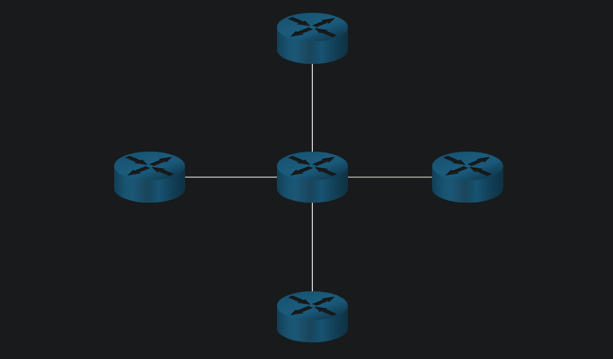
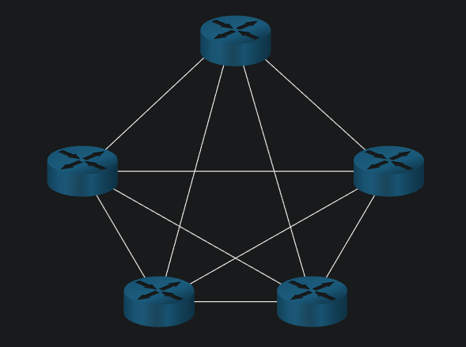
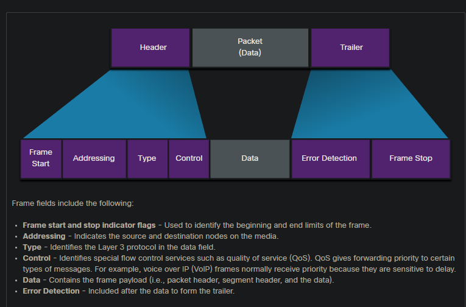

# Data Link Layer
The data link layer of the OSI model (Layer 2), prepares network data for the physical network. The data link layer is responsible for network interface card (NIC) to network interface card communications. The data link layer does the following:

* Enables upper layers to access the media. The upper layer protocol is completely unaware of the type of media that is used to forward the data.
* Accepts data, usually Layer 3 packets (i.e., IPv4 or IPv6), and encapsulates them into Layer 2 frames.
* Controls how data is placed and received on the media.
* Exchanges frames between endpoints over the network media.
* Receives encapsulated data, usually Layer 3 packets, and directs them to the proper upper-layer protocol.
* Performs error detection and rejects any corrupt frame.

**The data link layer adds Layer 2 Ethernet destination and source NIC information to a Layer 3 packet. It would then convert this information to a format supported by the physical layer (i.e., Layer 1).**

### 6.2.2 WAN Topologies
### Point to point

### Hub and Spoke
This is a WAN version of the star topology in which a central site interconnects branch sites through the use of point-to-point links. Branch sites cannot exchange data with other branch sites without going through the central site.

### Mesh

This topology provides high availability but requires that every end system is interconnected to every other system. Therefore, the administrative and physical costs can be significant. Each link is essentially a point-to-point link to the other node.

### 6.2.4 LAN Topologies
In multiaccess LANs, end devices (i.e., nodes) are interconnected using star or extended star topologies, as shown in the figure. In this type of topology, end devices are connected to a central intermediary device, in this case, an Ethernet switch. An extended star extends this topology by interconnecting multiple Ethernet switches. The star and extended topologies are easy to install, very scalable (easy to add and remove end devices), and easy to troubleshoot. Early star topologies interconnected end devices using Ethernet hubs.

At times there may be only two devices connected on the Ethernet LAN. An example is two interconnected routers. This would be an example of Ethernet used on a point-to-point topology.

### 6.2.5 Half and Full Duplex Communication

Half-duplex communications restrict the exchange of data to one direction at a time. Full-duplex allows the sending and receiving of data to happen simultaneously.

### 6.2.6 Access Control Methods
Ethernet LANs and WLANs are examples of multiaccess networks. A multiaccess network is a network that can have two or more end devices attempting to access the network simultaneously.

Some multiaccess networks require rules to govern how devices share the physical media. There are two basic access control methods for shared media:

* Contention-based access
* Controlled access

Contention-based access 

In contention-based multiaccess networks, a**ll nodes are operating in half-duplex**, competing for the use of the medium. However, only one device can send at a time. Therefore, there is a process if more than one device transmits at the same time. Examples of contention-based access methods include the following:

Carrier sense multiple access with collision detection (CSMA/CD) used on legacy bus-topology Ethernet LANs
Carrier sense multiple access with collision avoidance (CSMA/CA) used on Wireless LANs

Controlled access

In a controlled-based multiaccess network, each node has its own time to use the medium. These deterministic types of legacy networks are inefficient because a device must wait its turn to access the medium. Examples of multiaccess networks that use controlled access include the following:

* Legacy Token Ring
* Legacy ARCNET

**Note: Today, Ethernet networks operate in full-duplex and do not require an access method.**

## 6.3 Data Link Frame
### 6.3.2 Frame Fields
Framing breaks the stream into decipherable groupings, with control information inserted in the header and trailer as values in different fields. This format gives the physical signals a structure that are by recognized by nodes and decoded into packets at the destination.

The generic frame fields are shown in the figure. Not all protocols include all these fields. The standards for a specific data link protocol define the actual frame format.

