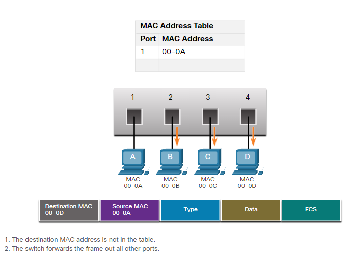

# 7.3 The MAC Address Table
## 7.3.1 Switch Fundamentals
A Layer 2 Ethernet switch uses Layer 2 MAC addresses to make forwarding decisions.
 The switch makes its forwarding decisions based solely on the Layer 2 Ethernet MAC addresses.

## 7.3.2 Switch Learning and Forwarding 
The switch dynamically builds the MAC address table by examining the source MAC address of the frames received on a port.  The switch forwards frames by searching for a match between the destination MAC address in the frame and an entry in the MAC address table.

### Examine the Source MAC Address

Every frame that enters a switch is checked for new information to learn. It does this by examining the source MAC address of the frame and the port number where the frame entered the switch. If the source MAC address does not exist, it is added to the table along with the incoming port number. If the source MAC address does exist, the switch updates the refresh timer for that entry in the table. By default, most Ethernet switches keep an entry in the table for 5 minutes.

In the figure for example, PC-A is sending an Ethernet frame to PC-D. The table shows the switch adds the MAC address for PC-A to the MAC Address Table.

**Note:** If the source MAC address does exist in the table but on a different port, the switch treats this as a new entry. The entry is replaced using the same MAC address but with the more current port number.

### Find the Destination MAC Address

If the destination MAC address is a unicast address, the switch will look for a match between the destination MAC address of the frame and an entry in its MAC address table. If the destination MAC address is in the table, it will forward the frame out the specified port. If the destination MAC address is not in the table, the switch will forward the frame out all ports except the incoming port. This is called an unknown unicast.

As shown in the figure, the switch does not have the destination MAC address in its table for PC-D, so it sends the frame out all ports except port 1.

Note: If the destination MAC address is a broadcast or a multicast, the frame is also flooded out all ports except the incoming port.

## 7.3.3 Filtering Frames
As a switch receives frames from different devices, it is able to populate its MAC address table by examining the source MAC address of every frame. When the MAC address table of the switch contains the destination MAC address, it is able to filter the frame and forward out a single port.

(So if the destination MAC is in the swithching table it will only foward to that port if the address is unicast)

# 7.4 Switch Speeds and Forwarding Methods

## 7.4.1 Frame Forwarding Methods on Cisco Switches
With Cisco switches, there are actually two frame forwarding methods and there are good reasons to use one instead of the other, depending on the situation.

Switches use one of the following forwarding methods for switching data between network ports:

* Store-and-forward switching - This frame forwarding method receives the entire frame and computes the CRC. CRC uses a mathematical formula, based on the number of bits (1s) in the frame, to determine whether the received frame has an error. If the CRC is valid, the switch looks up the destination address, which determines the outgoing interface. Then the frame is forwarded out of the correct port.
* Cut-through switching - This frame forwarding method forwards the frame before it is entirely received. At a minimum, the destination address of the frame must be read before the frame can be forwarded.

A big advantage of store-and-forward switching is that it determines if a frame has errors before propagating the frame. When an error is detected in a frame, the switch discards the frame. Discarding frames with errors reduces the amount of bandwidth consumed by corrupt data. Store-and-forward switching is required for quality of service (QoS) analysis on converged networks where frame classification for traffic prioritization is necessary. For example, voice over IP (VoIP) data streams need to have priority over web-browsing traffic.

There are two variants of cut-through switching:

* Fast-forward switching - Fast-forward switching offers the lowest level of latency. Fast-forward switching immediately forwards a packet after reading the destination address. Because fast-forward switching starts forwarding before the entire packet has been received, there may be times when packets are relayed with errors. This occurs infrequently, and the destination NIC discards the faulty packet upon receipt. In fast-forward mode, latency is measured from the first bit received to the first bit transmitted. 
Fast-forward switching is the typical cut-through method of switching.
* Fragment-free switching - In fragment-free switching, the switch stores the first 64 bytes of the frame before forwarding. Fragment-free switching can be viewed as a compromise between store-and-forward switching and fast-forward switching. The reason fragment-free switching stores only the first 64 bytes of the frame is that most network errors and collisions occur during the first 64 bytes. Fragment-free switching tries to enhance fast-forward switching by performing a small error check on the first 64 bytes of the frame to ensure that a collision has not occurred before forwarding the frame. Fragment-free switching is a compromise between the high latency and high integrity of store-and-forward switching, and the low latency and reduced integrity of fast-forward switching.

Some switches are configured to perform cut-through switching on a per-port basis until a user-defined error threshold is reached, and then they automatically change to store-and-forward. When the error rate falls below the threshold, the port automatically changes back to cut-through switching.