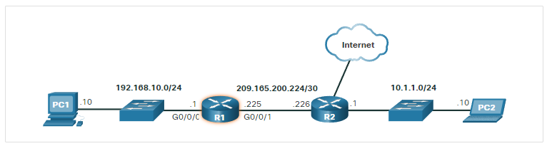

### 8.2.1 IPv4 Packet Header
IPv4 is one of the primary network layer communication protocols. The IPv4 packet header is used to ensure that this packet is delivered to its next stop on the way to its destination end device.

### 8.2.2 IPv4 Packet Header Fields

Significant fields in the IPv4 header include the following:

* Version - Contains a 4-bit binary value set to 0100 that identifies this as an IPv4 packet.
* Differentiated Services or DiffServ (DS) - 8-bit field used to determine the priority of each packet. The six most significant bits of the DiffServ field are the differentiated services code point (DSCP) bits and the last two bits are the explicit congestion notification (ECN) bits.
* Time to Live (TTL) – TTL contains an 8-bit binary value that is used to limit the lifetime of a packet. The source device of the IPv4 packet sets the initial TTL value. It is decreased by one each time the packet is processed by a router. If the TTL field decrements to zero, the router discards the packet and sends an Internet Control Message Protocol (ICMP) Time Exceeded message to the source IP address. Because the router decrements the TTL of each packet, the router must also recalculate the Header Checksum.
* Protocol – This field is used to identify the next level protocol. This 8-bit binary value indicates the data payload type that the packet is carrying, which enables the network layer to pass the data to the appropriate upper-layer protocol. Common values include ICMP (1), TCP (6), and UDP (17).
* Header Checksum – This is used to detect corruption in the IPv4 header.
Source IPv4 Address – This contains a 32-bit binary value that represents the source IPv4 address of the packet. The source IPv4 address is always a unicast address.
* Destination IPv4 Address – This contains a 32-bit binary value that represents the destination IPv4 address of the packet. The destination IPv4 address is a unicast, multicast, or broadcast address.
The two most commonly referenced fields are the source and destination IP addresses. These fields identify where the packet is coming from and where it is going. Typically, these addresses do not change while travelling from the source to the destination.


### 8.3.1 Limitations of IPv4

IPv4 is still in use today. This topic is about IPv6, which will eventually replace IPv4. To better understand why you need to know the IPv6 protocol, it helps to know the limitations of IPv4 and the advantages of IPv6.

Through the years, additional protocols and processes have been developed to address new challenges. However, even with changes, IPv4 still has three major issues:

* IPv4 address depletion - IPv4 has a limited number of unique public addresses available. Although there are approximately 4 billion IPv4 addresses, the increasing number of new IP-enabled devices, always-on connections, and the potential growth of less-developed regions have increased the need for more addresses.
* Lack of end-to-end connectivity - Network Address Translation (NAT) is a technology commonly implemented within IPv4 networks. NAT provides a way for multiple devices to share a single public IPv4 address. However, because the public IPv4 address is shared, the IPv4 address of an internal network host is hidden. This can be problematic for technologies that require end-to-end connectivity.
* Increased network complexity – While NAT has extended the lifespan of IPv4 it was only meant as a transition mechanism to IPv6. NAT in its various implementation creates additional complexity in the network, creating latency and making troubleshooting more difficult.

## 8.3.2 IPv6 Overview
In the early 1990s, the Internet Engineering Task Force (IETF) grew concerned about the issues with IPv4 and began to look for a replacement. This activity led to the development of IP version 6 (IPv6). IPv6 overcomes the limitations of IPv4 and is a powerful enhancement with features that better suit current and foreseeable network demands.

Improvements that IPv6 provides include the following:

* Increased address space - IPv6 addresses are based on 128-bit hierarchical addressing as opposed to IPv4 with 32 bits.
* Improved packet handling - The IPv6 header has been simplified with fewer fields.
* Eliminates the need for NAT - With such a large number of public IPv6 addresses, NAT between a private IPv4 address and a public IPv4 is not needed. This avoids some of the NAT-induced problems experienced by applications that require end-to-end connectivity.

The 32-bit IPv4 address space provides approximately 4,294,967,296 unique addresses. IPv6 address space provides 340,282,366,920,938,463,463,374,607,431,768,211,456, or 340 undecillion addresses. This is roughly equivalent to every grain of sand on Earth.

## 8.3.4 IPv6 Packet Header
The IP protocol header diagram in the figure identifies the fields of an IPv6 packet.

The fields in the IPv6 packet header include the following:

* Version - This field contains a 4-bit binary value set to 0110 that identifies this as an IP version 6 packet.
* Traffic Class - This 8-bit field is equivalent to the IPv4 Differentiated Services (DS) field.
* Flow Label - This 20-bit field suggests that all packets with the same flow label receive the same type of handling by routers.
* Payload Length - This 16-bit field indicates the length of the data portion or payload of the IPv6 packet. This does not include the length of the IPv6 header, which is a fixed 40-byte header.
* Next Header - This 8-bit field is equivalent to the IPv4 Protocol field. It indicates the data payload type that the packet is carrying, enabling the network layer to pass the data to the appropriate upper-layer protocol.
* Hop Limit - This 8-bit field replaces the IPv4 TTL field. This value is decremented by a value of 1 by each router that forwards the packet. When the counter reaches 0, the packet is discarded, and an ICMPv6 Time Exceeded message is forwarded to the sending host,. This indicates that the packet did not reach its destination because the hop limit was exceeded. Unlike IPv4, IPv6 does not include an IPv6 Header Checksum, because this function is performed at both the lower and upper layers. This means the checksum does not need to be recalculated by each router when it decrements the Hop Limit field, which also improves network performance.
* Source IPv6 Address - This 128-bit field identifies the IPv6 address of the sending host.
* Destination IPv6 Address - This 128-bit field identifies the IPv6 address of the receiving host.
An IPv6 packet may also contain extension headers (EH), which provide optional network layer information. Extension headers are optional and are placed between the IPv6 header and the payload. EHs are used for fragmentation, security, to support mobility and more.

## 8.4 How a Host Routes

### 8.4.1 Host Forwarding Decision
With both IPv4 and IPv6, packets are always created at the source host. The source host must be able to direct the packet to the destination host. To do this, host end devices create their own routing table.

Another role of the network layer is to direct packets between hosts. A host can send a packet to the following:

* Itself - A host can ping itself by sending a packet to a special IPv4 address of 127.0.0.1 or an IPv6 address ::1, which is referred to as the loopback interface. Pinging the loopback interface tests the TCP/IP protocol stack on the host.
* Local host - This is a destination host that is on the same local network as the sending host. The source and destination hosts share the same network address.
* Remote host - This is a destination host on a remote network. The source and destination hosts do not share the same network address.
The figure illustrates PC1 connecting to a local host on the same network, and to a remote host located on another network.

Whether a packet is destined for a local host or a remote host is determined by the source end device. The source end device determines whether the destination IP address is on the same network that the source device itself is on. The method of determination varies by IP version:

* In IPv4 - The source device uses its own subnet mask along with its own IPv4 address and the destination IPv4 address to make this determination.
* In IPv6 - The local router advertises the local network address (prefix) to all devices on the network.

In a home or business network, you may have several wired and wireless devices interconnected together using an intermediary device, such as a LAN switch or a wireless access point (WAP). This intermediary device provides interconnections between local hosts on the local network. Local hosts can reach each other and share information without the need for any additional devices. If a host is sending a packet to a device that is configured with the same IP network as the host device, the packet is simply forwarded out of the host interface, through the intermediary device, and to the destination device directly.

Of course, in most situations we want our devices to be able to connect beyond the local network segment, such as out to other homes, businesses, and the internet. Devices that are beyond the local network segment are known as remote hosts. **When a source device sends a packet to a remote destination device, then the help of routers and routing is needed. Routing is the process of identifying the best path to a destination.** The router connected to the local network segment is referred to as the default gateway.


### 8.4.2 Default Gateway
The default gateway is the network device (i.e., router or Layer 3 switch) that can route traffic to other networks. If you use the analogy that a network is like a room, then the default gateway is like a doorway. If you want to get to another room or network you need to find the doorway.

### 8.4.4 Host routing tables

Entering the:

``` netstat -r command``` or the equivalent ```route print``` command displays three sections related to the current TCP/IP network connections:

* Interface List - Lists the Media Access Control (MAC) address and assigned interface number of every network-capable interface on the host, including Ethernet, Wi-Fi, and Bluetooth adapters.
* IPv4 Route Table - Lists all known IPv4 routes, including direct connections, local network, and local default routes.
* IPv6 Route Table - Lists all known IPv6 routes, including direct connections, local network, and local default routes.

### 8.5.6 Introduction to an IPv4 Routing Table
Notice in the figure that R2 is connected to the internet. Therefore, the administrator configured R1 with a default static route sending packets to R2 when there is no specific entry in the routing table that matches the destination IP address. R1 and R2 are also using OSPF routing to advertise directly connected networks.


Host PC1, with an address of .10, is connected to a switch on network 192.168.10.0/24 which is connected to the G0/0/0 interface of router R1 with an address of .1. Network 209.165.200.224/30 connects the G0/0/1 interface on R1, address .225, to another router, R2 at address .226. R2 is connected to a switch on network 10.1.1.0/24 to which host PC2, address .10, is connected. R2 also has a connection to the Internet cloud.

```
R1# show ip route
Codes: L - local, C - connected, S - static, R - RIP, M - mobile, B - BGP
       D - EIGRP, EX - EIGRP external, O - OSPF, IA - OSPF inter area 
       N1 - OSPF NSSA external type 1, N2 - OSPF NSSA external type 2
       E1 - OSPF external type 1, E2 - OSPF external type 2
       i - IS-IS, su - IS-IS summary, L1 - IS-IS level-1, L2 - IS-IS level-2
       ia - IS-IS inter area, * - candidate default, U - per-user static route
       o - ODR, P - periodic downloaded static route, H - NHRP, l - LISP
       a - application route
       + - replicated route, % - next hop override, p - overrides from PfR
Gateway of last resort is 209.165.200.226 to network 0.0.0.0
S*    0.0.0.0/0 [1/0] via 209.165.200.226, GigabitEthernet0/0/1
      10.0.0.0/24 is subnetted, 1 subnets
O        10.1.1.0 [110/2] via 209.165.200.226, 00:02:45, GigabitEthernet0/0/1
      192.168.10.0/24 is variably subnetted, 2 subnets, 2 masks
C        192.168.10.0/24 is directly connected, GigabitEthernet0/0/0
L        192.168.10.1/32 is directly connected, GigabitEthernet0/0/0
      209.165.200.0/24 is variably subnetted, 2 subnets, 2 masks
C        209.165.200.224/30 is directly connected, GigabitEthernet0/0/1
L        209.165.200.225/32 is directly connected, GigabitEthernet0/0/1
R1#
```

The show ip route privileged EXEC mode command is used to view the IPv4 routing table on a Cisco IOS router. The example shows the IPv4 routing table of router R1. At the beginning of each routing table entry is a code that is used to identify the type of route or how the route was learned. Common route sources (codes) include these:

* L - Directly connected local interface IP address
* C – Directly connected network
* S – Static route was manually configured by an administrator
* O - OSPF
* D - EIGRP


The routing table displays all of the known IPv4 destination routes for R1.

A directly connected route is automatically created when a router interface is configured with IP address information and is activated. The router adds two route entries with the codes C (i.e., the connected network) and L (i.e., the local interface IP address of the connected network). The route entries also identify the exit interface to use to reach the network. The two directly connected networks in this example are 192.168.10.0/24 and 209.165.200.224/30.

Routers R1 and R2 are also using the OSPF dynamic routing protocol to exchange router information. In the example routing table, R1 has a route entry for the 10.1.1.0/24 network that it learned dynamically from router R2 via the OSPF routing protocol.

A default route has a network address of all zeroes. For example, the IPv4 network address is 0.0.0.0. A static route entry in the routing table begins with a code of S*, as highlighted in the example.